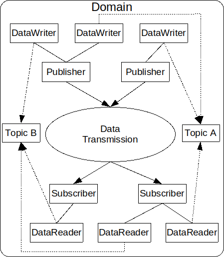
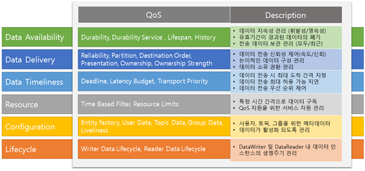
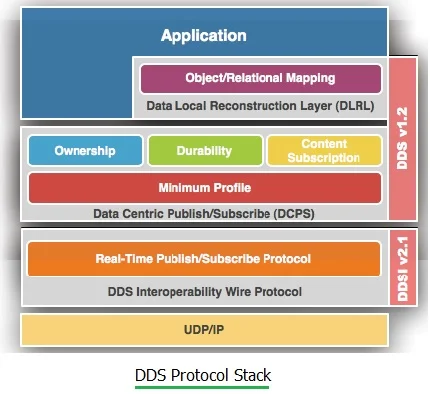

___

- [Introduction DDS](#introduction-dds)
  - [Basic Concepts](#basic-concepts)
    - [Domain](#domain)
    - [Entity](#entity)
    - [Domain Participant](#domain-participant)
    - [Topic](#topic)
    - [Samplem, Instances, and Types](#samplem-instances-and-types)
    - [DataWriter](#datawriter)
    - [Publisher](#publisher)
    - [Subscriber](#subscriber)
  - [Discovery, Matching, and Association](#discovery-matching-and-association)
  - [QoS (Quality of Service) Policies](#qos-quality-of-service-policies)
    - [QoS Policy 종류](#qos-policy-종류)
    - [QoS 검증](#qos-검증)
      - [Realibility](#realibility)
      - [Deadline](#deadline)
      - [Time-Based Filter](#time-based-filter)
      - [Destination Order](#destination-order)
      - [Partition](#partition)
      - [Ownership](#ownership)
  - [Listener](#listener)
  - [DDS Protocol](#dds-protocol)
# Introduction DDS
* DDS
  * Data Distribution Service의 준말
  * Object Management Group(OMG)사에서 게시한 publish-subscribe paradigm에 기반된 분산 시스템에 대한 사양
  * DDS 어플리케이션은 Topic 및 QoS 정책을 기반으로 하는 강력한 유형의 비동기 캐시 업데이트를 사용하여 네트워크 전체에서 데이터를 효율적으로 공유
  * DDS는 실시간 시스템의 실시간성(Real Time), 규모의 확장성(Scalable), 안정성(Dependable), 고성능(High performance)를 가능하게 하는 OMG(Object Management Group)의 표준 Publish/Subscribe Model 구조를 가진 네트워크 미들웨어
  * 데이터 중심의 분산서비스를 지원하며 정확한 메시지 전달을 위해 다양한 네트워크 제어 QoS(Quality of Services)를 지원
    * DDS는 22가지의 네트워크 제어 QoS 정책을 통하여 정밀한 데이터 흐름제어를 지원하고 있으며, 이를 통해 언제든지 정확한 시간과 장소에 올바른 데이터를 전송 가능하도록 한다.
## Basic Concepts
* Overview of the DDS DCPS API
  

### Domain
* Domain은 DCPS내의 기본 분할 단위(가장 작은 단위)
* 다른 각 Entity는 도메인에 속하며 동일한 도메인의 다른 Entity와만 상호 작용 할 수 있다.
  * 애플리케이션 코드는 여러 도메인과 자유롭게 상호 작용 할 수 있지만, 다른 도메인에 속하는 별도의 Entity를 통해 상호작용 해야함
* Domain은 Identifier에 의해 식별
### Entity
* Entity는 QoS 정책과 State가 있고, Listeners 및 waitsets과 함께 사용할 수 있는 Domain의 Entity.
* DCPS Domain의 다른 개념에 의해 구현되는 인터페이스
* QoS Policy는 해당 Entity에 맞게 specialized 된다.
### Domain Participant
* Domain Participant는 애플리케이션이 특정 도메인 내에서 상호작용하는 진입점 역할
* Discovery 과정을 통해 특정 도메인에 존재하는 같은 도메인에 존재하는 도멩니 참가자를 식별하고 통신 수행에 필요한 정보를 교환
* DataWriter와 DataReader가 존재하며 이들을 EndPoint라고 함
  * 실질적 통신은 이 EndPoint 사이에서 일어남
### Topic
* Topic은 Application Publisher와 Subscriber간의 기본 상호 작용 수단
* 각 Topic에는 Publisher와 Subscriber를 연결하는 Domain 내에서 고유한 이름 존재
* 여러 프로세스가 하나의 주제에 대해 Pub할 수 있고 여러 프로세스가 Many-To-Many 통신을 허용하는 Topic을 Subscription 할 수 있다.
* Publisher 프로세스는 Sample을 Publishing 할때 Topic을 지정하고 Subscrier 프로세스는 Topic을 통해 Sample을 요청
* 
### Samplem, Instances, and Types
* Sample, Instance
  * DCPS 용어로 애플리케이션은 Topic에 대한 다양한 Instance에 대한 개별 데이터 샘플을 게시
    * 각 항목에는 샘플을 설명하는 특정 유형이 존재
    * 각 Topic 데이터 유형은 해당 키를 구성하는 0개 이상의 필드를 지정
    * 각 인스턴스는 키의 고유한 값과 연결
  * Publisher 프로세스 에서는 각 샘플에 대해 동일한 키 값을 사용하여 동일한 인스턴스에 여러 데이터 샘플을 Publishing
* Types
  * 컴파일 타임(Static Type) or 런타임(Dynamic Type)에 정의 (모두 사용 가능)
  * Static Type은 OMG Interface Definition Language를 사용하여 정의
  * Dynamic Type은 API를 통해 생성하거나 획득 (OpenDDS 지원 X)
  
### DataWriter
* Datawriter는 배포용 샘플을 도입하기 위해 Publishing application code에서 사용
* 각 Datawriter는 특정 Topic에 바인딩
* Application은 Datawriter의 유형별 interface를 사용하여 해당 Topic에 대한 샘플을 Publishing
* Datawriter는 Data를 DataReader에게 전달

### Publisher
* Publisher는 게시된 데이터를 가져와 도메인에 있는 모든 관련된 Subscriber에게 배포
* Participant는 여러 Publisher를 가질 수 있으며, 각 Publihser는 서로 다른 Topic에 관한 여러 Datawriter를 가질 수 있다.
  
### Subscriber
* Subscriber는 Publisher로부터 데이터를 받아 이에 속한 모든 관련된 DataReader에 전달
* DataReader는 특정 Topic에 바인딩되며, 애플리케이션은 Datareader의 유형별 Interface를 사용하여 Sample을 Subscriber 한다.

## Discovery, Matching, and Association
* Discovery는 Participant가 제공하는 Publications 및 Subscriptions에 대해 배우는 프로세스
* Matching
  * Remote Publisher 및 Subscription을 발견한 Participant는 Remote Entity와 비교하여 호환되는지 확인
  * Datawriter와 Datareader는 동일한 Topic에 있고, 호환가능한 유형이 있고, 호환 가능한 QoS가 있는경우 Matching
* Association
  * Local Entity가 Remote Entity와 일치하는 경우 Datawrtier에서 Datareader로 데이터가 흐르도록 구현이 구성

## QoS (Quality of Service) Policies
* DDS사양은 서비스에 대한 QoS 요구 사항을 지정하기 위해 애플리케이션에서 사용하는 다양한 QoS 정책을 정의
* Participant는 서비스에서 필요한 동작을 지정하고 서비스는 이러한 동작을 달성하는 방법을 결정
* 모든 정책이 모든 유형의 Entity에 유효한 것은 아니지만 이러한 정책은 다양한 DCPS Entity(Topic, Datawriter, Datareader, Publisher, Subscriber, Domain Participant)에 적용될 수 있다.
* Publisher와 Subscriber는 RxO(Request x Offered) 모델을 사용하여 일치
  * Subscriber는 최소한으로 필요한 정책 세트를 요청
  * Publisher는 잠재적인 Participant에게 일련의 QoS 정책을 제공
  * DDS 구현은 요청된 정책을 제공된 정책과 일치시키기 위해 시도
### QoS Policy 종류
* DDS에서는 네트워크 제어를 위해 22가지의 QoS 정책을 지원하고 있으며, 이들은 특성에 따라 6개로 분류
  
  
* Data Availability
  * DDL는 도메인 참여자에 대한 데이터 가용성을 제어하는 QoS 정책을 다음과 같이 제공
  * Durability QoS
    * 도메인의 전역 데이터 공간(GDS)에 기록되는 데이터의 수명을 제어
    * VOLATILE : 데이터가 Publish 된 후에는 DDS에 전달할 데이터가 유지되지 않음을 나타냄
    * TANSIENT_LOCAL : Publisher가 데이터를 로컬에 저장하여 늦은 가입한 가입자 Publisher가 아직 살아 있다면, 마지막으로 Publish 된 항목을 가ㅕㅈ옴
    * TRANSIENT : GDS가 해당 지역의 범위를 벗어난 정보를 유지하도록 보장
    * PERSISTENT : GDS가 정보를 지속적으로 저장하여 전체 시스템을 종료하고 재시작 한 후에도 늦은 참여자가 사용할 수 있도록 함
    * 내구성은 비휘발성 Topic들의 DURABILITY_SERVICE QoS를 통해 구성된 속성이 있는 내구성 서비스에 의존함으로써 달성
  * LIFESPAN QoS
    * 데이터 샘플이 유효한 시간 간격을 제어, 기본값은 무한대이며 대체 값은 데이터가 유효한 것으로 간주되는 시간 범위
  * HISTORY QoS
    * Readers 또는 Writers 용으로 저장해야 하는 데이터 샘플 수를 제어
    * KEEP_LAST / KEEP_ALL
* Data Delivery
  * DDS는 데이터를 전달하는 방법과 Publisher가 데이터 업데이트에 대한 독점권을 주장 할 수 있는 방법을 제어
    * PRESENTATION QoS
      * 정보모델의 변경 사항을 Subscriber에게 제공하는 방법을 제어
      * 데이터 업데이트의 일관성뿐만 아니라 순서를 제어
      * 적용 범위는 액세스 범위에 의해 정의되며 INSTANCE, TOPIC 또는 GROUP 수준 중 하나일 수 있음
    * RELIABILITY QoS
      * 데이터 확산과 관련된 안정성 수준을 제어
      * BEST_EFFORT
        * DDS 데이터 샘플을 한번만 DataReaders에 보낸다
        * 전송된 DDS 샘플을 수신했는지 여부를 추적하기 위해 effort나 resource를 사용하지 않음
        * 데이터를 버퍼링하거나 재전송함으로써 도입될 수 있는 비결정적 지연이 없기 때문에 데이터를 전송하는 가장 결정적인 방법
          * DDS 데이터 샘플이 유실될 수 있음
      * RELIABLE
        * DDS 샘플을 DataReader에서 수신 된 것으로 확인되고 전송 중에 손실되었을 수 도 있는 DDS 샘플을 다시 보내기 전까지는 보낸 데이터를 DataReaders의 버퍼에 안정적으로 보관
        * HISTORY 및 RESOURCE_LIMITS QoS 정책들을 통해 이러한 QoS를 실행하기 위해 얼마나 자원을 사용할지 선택할 수 있음
    * PARTITIOIN QoS
      * DDS 파티션과 Publisher/Subscriber의 특정 인스턴스 간의 연결을 제어
      * DDS 구현에 서로 다른 파티션에서 생성된 트래픽을 분리 할 수 있는 추상화 기능을 제공
      * 전반적인 시스템 확장 및 성능 향상
    * DESTINATION_ORDER QoS
      * Publisher가 주어진 Topic의 일부 인스턴스에 적용한 변경 순서를 제어
      * DDS를 사용하면 발신 또는 수신 타임스탬프에 따라 다양한 변경 사항을 정렬할 수 있음
    * OWNERSHIP QoS
      * 다중 Writers가 있고 소유권이 독점인 경우 작성자가 특정 Topic에 대한 쓰기 액세스를 소유하고 있는지 여부를 제어
      * 가장 높은 OWNERSHIP STRENGTH의 Writer만 데이터를 Publish
      * OWNERSHIP QoS Policy 값이 공유되면, 다중 Writers는 Topic을 동시에 갱신 할 수 있으며, OWNERSHIP은 동일한 데이터의 복제된 Publisher를 관리하는데 도움이 됨
* Data Timeliness
  * DEADLINE QoS
    * 응용프로그램이 데이터의 최대 도착시간 간격을 정의하도록 허용
    * DDS는 Deadline 내 데이터가 누락된 경우 응용 프로그램에 자동으로 알리도록 구성
    * DatWriter의 Deadline QoS 정책은 응용 프로그램이 DataWriter에서 write()를 호출하여 새로운 DDS 샘플을 발행 할 최대 기간을 나타냄
    * DataReader에서의 Deadline QoS 정책은 응용프로그램이 Topic에 대한 새값을 받을 최대 기간을 나타냄
  * LATENCY_BUDGET QoS
    * 응용 프로그램이 전송된 데이터와 관련된 긴급성을 DDS에 알릴 수 있는 방법을 제공
    * 대기 시간은 DDS가 정보를 배포해야 하는 기간을 지정
      * Publisher가 데이터를 기록한 순간부터 시작
  * TRANSPORT_PRIORITY QoS
    * 응용 프로그램이 Topic 또는 Topic 인스턴스와 관련된 중요성을 제어 할 수 있게 하여 DDS 구현이 덜 중요한 데이터에 비해 보다 중요한 데이터를 우선순위로 지정할 수 있게 한다.
* Resources
  * TIME BASED FILTER QoS
    * DataWriter가 데이터 인스턴스의 새 DDS 샘플을 게시하는 속도에 관계없이 DataReader의 데이터 인스턴스에 대해 지정된 기간마다 데이터가 두번 이상 전달되지 않도록 지정
    * 필요한 양의 데이터만 다른 DataReaders에 전달하여 리소스 사용량(CPU 및 네트워크 대역폭)을 최적화 할 수 있다.
    * 
  * RESOURCE LIMITS QoS
    * 애플리케이션이 Topic 인스턴스 및 관련된 많은 샘플을 보유 할 수 있는 가용 스토리지를 최대한 제어 할 수 있도록 허용
    * DDS가 할당할 수 있는 시스템 메모리 양을 제한하는데 사용
* Configuration
  * QoS 정책은 데이터 전달, 가용성, 적시성 및 리소스 사용의 가장 중요한 측면을 제어
  * USER DATA QoS
    * 응용 프로그램은 도메인 참여자, DataReader 및 DataWriter에게 일련의 8진수 연결을 허용
    * 내장된 Topic을 통해 배포되며, 보안 자격 증명을 배포하는 데 주로 사용
  * TOPIC DATA QoS
    * 응용 프로그램이 옥텟 시퀀스를 Topic과 연관시킬 수 있게 함
    * IDL 타입 코드 또는 XML 스키마와 같은 추가 정보 또는 메타 정보로 Topic을 확장하는데 사용
  * GROUP DATA QoS
    * 응용 프로그램이 Publisher와 Subscriber와 함께 옥텟 시퀀스를 연결할 수 있음
* Lifecycle
  * WRITER DATA LIFECYCLE QoS
    * DataWriter가 관리하도록 등록된 인스턴스(키)의 수명 주기를 DataWriter가 처리하는 방법을 제어
### QoS 검증
| QoS Policy | Description | chg. | RxO | Inst. | Entities |
| :--------: | :--------- | :--: | :--:|:----:|:----:|
| Realiability | 데이터의 신뢰 여부를 설정하는 정책으로 설정 값에 따라 신뢰성 보장, 빠른 효용성으로 동작 | BE | Y | | T,R,W |
| Deadline | 정해진 주기 안에 최소 한번의 데이터가 발생되는지를 확인하는 정책으로, 해당 정책이 지켜지지 않을 경우 사용자(응용)에게 정책 위반을 알림 | A | Y | Y | T,R,W |
| Time-Based Filter | 구독자에서 이용하는 QoS로, 발행되는 모든 데이터를 수신하지 않고 데이터를 구독할 주기를 설정하여 구독하는 정책 | BE | | Y | R |
| Destination Order | 구독자가 여러 발행자로부터 동일한 데이터를 수신하는 경우에 마지막 데이터를 판단하는 기준을 설정하는 정책 | BE | Y | Y | T,R,W |
| Partition | 같은 도메인에 참여하지만, 논리적으로 작은 그룹을 설정하는 정책으로 같은 구분자를 가진 하위 개념 객체(DW, DR)만 데이터 교환이 이루어지는 정책 | A | N | | P,S |
| Ownership | 여러 발행자가 동일한 데이터를 발행할 때, 데이터의 소유 여부를 설정하는 정책으로, 설정 값에 따라 여러 발행자의 데이터를 처리하거나, 소유권을 가진 특정 발행자의 데이터만 처리 가능 | BE | Y | Y | T,R,W |

* chg. = Changeable
  * 동작하면서도 QoS 값이 변경될 수 있는지 여부를 나타냄
* RxO = Request/Offered Semantics
  * "Y"인 경우는 데이터를 발행한 측과 데이터를 구독하는 측 양측에 값이 설정되어야 하며, 서로 양립할 수 있어야 함.
  * "N"인 경우는 데이터를 발행하는 측과 데이터를 구독하는 측 양측에 값이 설정되지만, 서로 독립적으로 동작할 수 있다.
  * " "인 경우는 데이터를 발행하는 측, 혹은 데이터를 구독하는 측 한 곳에만 값이 설정되므로, 양립성을 판단하지 않아도 됨.
* Inst. = Behavior is applied per-instance
* A = Always
* B = Before Enable
* T = Topic
* R = DataReader
* W = DataWriter
* P = Publisher
* S = Subscriber

#### Realibility
* Realibility
  * DataWriter에 의해 발행된 데이터가 DDS에 의해 일치하는 DataReaders로 안정적으로 전달될지 여부를 결정
  * BEST_EFFORT
    * 사람에게 값을 표시하는 GUI에 대한 센서 값의 주기적인 업데이트와 같은 일부 사용 예의 경우, "Best effort" 전달이 충분
    * 빠르고 효율적, 자원 집약적인 방법 Topic에 대한 최신데이터를 DataWriter에서 DataReader로 가져오는 방법
    * 전송된 데이터가 수신된다는 보장 X
  * RELIABLE
    * 손실되었을 수 있는 DDS 샘플을 다시 보내기 전까지는 보낸 데이터를 DataReaders의 버퍼에 안정적으로 보관
    * HISTORY 및 RESOURCE_LIMITS QOS를 통해 이러한 QoS 를 실행하기 위해 얼마나 자원을 사용할지 선택
      * HISTORY 종류가 KEEP_LAST인 경우, DataWriter는 전송 대기열의 Topic 인스턴스 당 DDS 샘플을 HISTORY의 Depth Number 만큼 가짐
      * 데이터 인스턴스의 전송 큐에 있는 확인되지 않은 DDS 샘플 수가 HISTORY Depth Number에 도달하면 인스턴스의 DataWriter에서 작성한 다음 DDS 샘플은 대기열에 있는 인스턴스의 가장 오래된 DDS 샘플을 덮어 쓴다.
        * 이는 수신 미확인 된 DDS 샘플을 덮어 쓸 수 있으므로 데이터가 손실될 수 있음을 의미
        * 따라서 신뢰성 종류가 RELIABLE인 경우에도 HISTORY 종류가 KEEP_LAST이면 DataWriter가 보낸 일부 데이터가 DataReader로 전달되지 않을 수 있다.
      * HISTORY 종류가 KEEP_ALL인 경우, 전송 대기열이 승인된 DDS 샘플로 채워질 때, DataWriter의 다음 write() 작업은 대기열의 DDS 샘플이 DataReaders에 의해 완전히 확인 응답되거나 덮어 쓸 수 있거나 RELIABILITY max_blocking_period의 시간 제한에 도달 할 때까지 차단
        * max_blocking_time에 도달했을 때 대기열에 여전히 공간이 없으면 write() 호출은 오류 코드 DDS_RETCODE_TIMEOUT와 함께 실패를 나타내는 값을 리턴한다.
      * **따라서 DataWriter에서 보낸 모든 DDS 데이터 샘플을 DataReader가 수신하도록 하는 엄격한 안정성을 위해 DataWriter 및 DataReader 모두에 대해 RELIABABLE 종류의 RELIABLE 및 HISTORY 종류의 KEEP_ ALL을 사용**
#### Deadline
* 응용 프로그램이 DataWriter에서 write()를 호출하여 새로운 DDS 샘플을 발행 할 최대 기간을 나타냄
  * 응용 프로그램은 이 QoS 정책으로 설정된 속도보다 빠르게 write()를 호출
* DataReader에서의 Deadline QoS 정책은 응용 프로그램이 Topic에 대한 새 값을 받을 최대 기간을 나타냄
  * 응용 프로그램은 이 QoS 정책에서 설정한 속도보다 빠른 속도로 데이터를 수신
#### Time-Based Filter
* Time_based_filter QoS 정책을 사용하면 DataWriter가 데이터 인스턴스의 새 DDS 샘플을 발행하는 속도에 관계없이 DataReader의 데이터 인스턴스에 대해 설정된 기간에 두 번 이상 데이터를 전송하지 않도록 지정
* 필요한 양의 데이터만을 다른 DataReader로 배달하여 리소스 사용(CPU및 네트워크 대역폭)을 최적화
* DataWriter는 DataReader가 필요로 하는 것보다 빠르게 데이터를 보낼 수 있음
#### Destination Order
* 여러 DataWriter가 같은 Topic에(동일한 항목) 대해 데이터를 보낼 때 다른 DataWriter의 데이터가 다른 DataReader의 응용 프로그램에 의해 수신되는 순서가 다를 수 있음
* 따라서 DataWriter가 데이터 전송을 중지 할 때 다른 DataReaders가 동일한 마지막(last)값을 받지 못할 수 있다.
* Destination Order은 각 노드가 다른 노드에서 실행되는 여러 DataWriter(다른 발행자와 연결될 수 있음)가 작성한 데이터 인스턴스의 최종 값을 각 구독자가 해결하는 방법을 제어
#### Partition
* PARTITION QoS는 DataWriter가 어떤 DataReader와 일치하여 통신 하는지를 제어하는 ​​또 다른 방법을 제공
* 동일한 토픽 및 QoS 정책과 일치해야하는 DataWriter 및 DataReader가 서로 통신하는 것을 방지하는 데 사용
* 동일한 DDS 도메인 내의 응용 프로그램만 서로 통신하는 것과 같은 방식으로 동일한 파티션에 속한 DataWriter 및 DataReaders만 서로 통신 할 수 있음 
#### Ownership
* Ownership QoS 정책은 DataReader가 여러 Datawriter가 보낸 Topic 인스턴스의 데이터를 수신할지 여부를 지정
* Shared Ownership
  * Ownership이 공유되고 Topic의 여러 DataWriter가 동일한 인스턴스의 값을 발행하면 모든 업데이트가 구독하는 DataReader로 전달
  * 실제로 소유자는 없으며 인스턴스의 값을 업데이트하는데는 단일 DataWriter가 책임지지 않는다. 
  * 구독 응용 프로그램은 모든 DataWriter에서 수정 사항을 수신
* Exclusive Ownership
  * 각 인스턴스는 한번에 하나의 DataWriter만 소유
  * 즉, 일치하는 DataWriter에 대해 인스턴스의 값을 수정할 수 있는 업데이트가 있는 독점적인 소유자로 단일 DataWriter가 식별
  * 다른 DataWriter는 인스턴스에 대한 수정 사항을 제출할 수 있지만 현재 소유자가 만든 데이터 웨어하우스만 DataReaders에 전달
  * DataWriter가 인스턴스를 수정하면 오류나 알림이 발생하지 않고, 수정은 무시되며, 인스턴스의 소유자는 동적으로 변경
## Listener
* DCPS API는 애플리케이션이 해당 Entity와 관련된 특정 상태 변경 또는 이벤트를 수신할 수 있도록 하는 각 Entity에 대한 콜백 Interface를 정의
  * Ex) 읽을 수 있는 데이터 값이 있으면 DataReader Listener에 알림이 전송

## DDS Protocol
* DDS Protocol Stack

* DDS 표준은 통신 미들웨어에서 데이터 Publish/Subscribe를 관리하는 DCPS(Data-Centric Publish-Subscribe)에 대한 규격 및 DCPS에서 지원하는 네트워크 제어 QoS 정책에 대한 내용을 포함
* DCPS 계층 상단에는 DDS 애플리케이션 또는 DLRL이 존재
* DCPS 하단에는 DDS 통신 프로토콜인 RTPS와 이를 실제 통신 프로토콜로 연결해주는 연결 프로토콜인 DDSI (DDS Interoperability Wire Protocol)이 있다.
* 
* DLRL
  * Data Local Reconstruction layer
  * DCPS 기능에 대한 인터페이스를 제공
  * IoT가 지원되는 장치 간에 분산된 데이터를 공유
* DCPS
  * Data-Centric Publish/Subscribe
  * 
  * 도메인 구성 객체, 데이터 발간/구독 인터페이스 등 Pub-Sub 하기 위한 인터페이스를 정의
  * QoS 항목과 QoS 항목들 사이의 관계와 적용 값의 우선순위를 정의
* RTPS
  * Real-Time Publish/Subscribe
  * 도메인을 구성하는 DomainParticipant 및 Endpoint에 대한 표준 검색 프로토콜을 정의
  * 데이터 발간 객체와 데이터 구독 객체의 동작, 데이터 송수신 상태 등을 정의
  * 데이터 Pub/Sub 모델을 지원하며 UDP/IP와 같이 신뢰성이 없는 전송계층 위에서도 동작 가능
  * DDS 상호 운용성을 위한 표준 유선 프로토콜
    * DDS를 구현한 제품들이 증가하게 되면서 이 제품들이 서로 만들어진 회사는 다르지만 서로 DDS간 통신을 하기 위해 RTPS Protocol을 이용