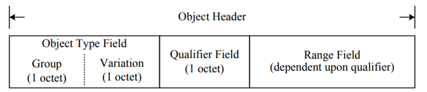

DNP 3.0
===

===

# DNP 3.0 Study
## Overview
* 프로토콜 개발 목적
  * 전기 관련 업계에서 RTU(Remote Terminal Unit), IED(Intelligent Electronic Device) 들과 Master Station 간에 공개된 표준을 기반으로 상호 운용성 확보
* 특징
  * OSI 7계층 모델에서 3가지 계층을 기반으로 설계
    * 물리 계층, 데이터 링크 계층, 응용 계층
  * 응용 계층
    * 가장 일반적인 데이터를 지원하기 위해 객체(Object) 기반
  * 데이터 링크 계층
    * 클래스(class) 및 객체의 변화를 폴링(Polling)하는 몇 가지 데이터 수집 방법 제공
  * 물리 계층
    * 가장 일반적으로 사용되는 단순한 RS-232 또는 RS-485 인터페이스 정의
  * DNP LAN 프로토콜도 개발됨 (TCP/IP 기반)
* Basic message and data flow
  * Master - Outstration
  
  1. Master Station 에서 데이터 전송
    * User Layer는 Application Layer가 Outstation에 요청을 보내도록 하여 데이터 전송 시작
    * 요청에는 데이터를 지정하는 Function Code와 0개 이상의 DNP3.0 Object가 포함됨
    * Application Layer는 요청을 Transport Function으로 전달
    * Transport Function은 전송 크기 단위로 분할한 다음 Data Link Layer로 전달
    * Data Link Layer는 주소 지정 및 오류 감지 정보(CRC, Cyclic Redundancy Check)를 추가하고 패킷을 물리적 매체를 통해 Outstation으로 전달
  2. Outstation에서 데이터 수신
    * Outstation의 Data Link Layer는 Physical Layer에서 octets을 수신하고 오류 확인(CRC)
    * Data Link Layer에서 추가된 주소 및 오류 감지 정보 제거 후 Application Layer로 전달
    * 필요한 경우 Transport Function은 여러 패킷을 완전한 패킷으로 재조립
    * Application Layer는 메시지의 Function Code와 DNP 3.0 Object를 해석 후 원하는 데이터를 User Layer에게 알림
  3. Outstation에서 데이터 전송
    * Master Station에서 요청한 데이터에 따라 User Layer에서 응답 시작
    * 데이터를 가져와서 분류 후 해당 데이터를 Application Layer에 전달
    * Application Layer는 DNP3.0 Object로 포맷된 데이터로 메시지 생성
    * Application Layer는 Tranport Function을 통해 Data Link Layer에 데이터 전달
      * 데이터 전달은 Master Station의 요청 방식와 유사하게 전달
  4. Master Station에서 데이터 수신
    * 응답을 수신하면 Data Link Layer에서 주소 및 오류 검사 수행 후 Application Layer 전달
    * Transport Function을 통해 완전한 메시지로 재조립
    * Application Layer에서는 DNP3.0 Object를 분석하고 User Layer에 정보를 제공
    * User Layer에서는 최종 사용자에게 적합한 방식으로 데이터를 저장하거나 조작
* Master는 항상 제어 명령을 시작
  * Outstation 내부 변수를 얻거나 제어
  * Transaction은 단일 요청 / 응답으로 구성됨
  * Master는 요청을 보내고 다른 요청을 보내기전에 응답 또는 시간초과를 기다림
  * 일부 시스템에서는 Master가 항상 데이터 전송을 시작하지 않음
    * "Unsolicited Response"으로 Master의 요청없이 Outstation에서 자동으로 데이터 보낼 수 있음
* Fragments, Segments, Frames

| Layer or function | Unit name            | Information                                                                                                                                                               |
| :---------------- | :------------------- | :------------------------------------------------------------------------------------------------------------------------------------------------------------------------ |
| Application Layer | Application Fragment | 각 Fragment 는 Application Header 를 포함                                                                                                                                 |
| Transport Layer   | Transport Segment    | Fragment를 세분화하여 Data Link Frame에 맞게 분할   첫번째 Segment에만 Application Header가 포함   각 Segment는 Transport Header를 포함하여 최대 250 octet까지 가능 |
| Data Link Layer   | Data Link Frame      | Frame은 Header와 CRC를 포함하여 최대 292 octet까지 가능   Frame은 오류 탐지를 위해 설계                                                                                |

* Unsolicited response
  * Master의 요청 없이 Outstation에서 자발적으로 보내는 메시지
  * 중요한 이벤트가 발생했을 때 전송
  * Outstation의 변경사항이 발생했을 때 빠르게 Master에게 메시지 전달
* IP Networking
  * IP 기반 시스템 환경이 발전함에 따라 DNP 3.0에서도 지원 필요성이 생김
    * 기존 DNP3.0은 Serial, 광섬유 케이블링 통신 등을 위해 설계되었음
  * DNP 3.0의 Data Link Layer 에서 TCP 또는 UDP 패킷으로 IP 네트워크를 통해 데이터 전달
## Application Layer Preface
* Application Layer
  * OSI 모델의 최상위 계층으로 DNP 3.0 에서는 사용자의 소프트웨어 및 하위 계층과의 연결을 담당
   
  * Point
    * 고유하게 식별가능한 물리적 또는 논리적 엔터티
    * Input : Binary, Analog, Counter
    * Output : Binary, Analog
    * Point Type
      * 물리적 하드웨어 또는 논리적 공간과의 관계를 갖는 Point를 분류하는 수단
    * DNP 3.0 에서는 각 Point Type을 독립적인 포인트 배열로 모델링
      * 배열내의 인덱스를 통해 접근 가능
    * Point Type Arrays
    
  * Indexes
    * 인덱스 번호, 배열의 요소를 접근하는데 사용
    * Zero-based 기반
      * ex) 10 Analog Input Points는 Index 0~9를 의미
  * Groups
    * 메시지 내의 데이터 유형을 분류하는데 사용
    * 각 Group 번호는 공통의 Point Type과 데이터 생성 방법을 제공
    * 그룹 번호는 시간, 파일 제어, 가상 터미널 및 기타 정보 등을 전송하는데 필요한 Data Type을 지정하는데에도 사용
  * Variations
    * 데이터 인코딩 포맷을 지정하는데 사용
    * 모든 Group 번호에는 독립적인 Varations 가 있음
    * Group 30 인경우 (예시)
      * Variation 1 : a 32-bit integer value with flag
      * Variation 2 : a 16-bit integer value with flag
      * Variation 3 : a 32-bit integer value
      * Variation 4 : a 16-bit integer value
      * Variation 5 : a 32-bit floating-point value with flag
      * Variation 6 : a 16-bit floating-point value with flag
  * DNP3 Object
    * 메시지 전송을 위해 Group, Variation 번호에 따라 데이터를 인코딩한 표현을 의미
    * 메시지는 여러 Object를 포함 할 수 있음
    * Object의 종류는 Static, Event, Class Data로 구성
    * Static
      * 최근에 측정, 계산 또는 얻은 Point의 현재값을 의미
      * Static Binary Input Data는 이진값으로 On/Off 상태를 나타냄
      * Static Analog Input Data는 아날로그 입력값을 나타냄
    * Event
      * 어떤 중요한 일이 발생하는 것을 의미
        * 상태 변경, 일부 임계값 초과, 데드벤드 이상의 아날로그 입력 등
      * Outstation에서 발생시키며, Master에게 보고됨
        * Outstation은 Master가 Event를 확인했다는 것을 인지한 후 Event Buffer에서 제거 함
    * Classes
      * DNP3은 클래스 개념을 사용해서 Static Data 및 Event를 구성
      * Class 0 : Static Data
      * Class 1, 2, 3 : Events
      * 3가지 상태 존재
        * Point에 Class 0 할당 된 경우
          * Point에 현재값을 반환, 이벤트는 발생하지 않음
        * Point에 Class 1, 2, 3이 할당된 경우
          * Point에 현재 값을 반환, 이벤트 저장, Master에게 이벤트 알림
        * Point에 어떠한 Class도 할당되지 않은 경우
          * 값 반환하지 않음, 이벤트 발생하지 않음
## Message Structure
* Application Layer Fragments
  * Master와 Outstation 간의 전송되는 요청/응답 정보를 포함하는 Octet 블록
  * Fragment 포함 정보
    * Function Code
    * 0개 이상의 Object Header 및 Data Object
    * Fragment 순서 정보
  * 메시지의 길이에 따라 여러 Fragment로 분할해서 전달
    * 제한된 시스템에서 메모리 사용 절약
* Application Layer Fragment Structure
  * General Fragment Structure
    * 메시지 제어 정보가 포함된 Application Header가 맨앞에 붙음
    * Application Response Header에는 "internal indication" 추가 필드 포함
      * Request에는 없음
    * 각 DNP3 Object 별로 Object Header를 포함
      * Application Header 만으로 뒤따르는 모든 정보를 표현할 수 없기 때문

* Application Request Header
  * Master에서 사용
  * 2개 필드로 구성
    * Application Control (1 octet)
    * Function Code (1 octet)

* Application Response Header
  * Oustation에서 사용
  * 3개 필드로 구성
    * Application Control (1 Octet)
    * Function Code (1 Octet)
    * Internal Indications (2 Octet)

* Application Control
  * 다중 Fragment 재조립
  * 메시지 확인
  * 중복 메시지 검사
  * 순서 번호
  * FIR field -> Frame Identifier ?
    * single bit
    * FIR = 0 : 첫번째 fragment가 아님
    * FIR = 1 : 첫번째 fragment
  * FIN field -> Finish
    * Single bit
    * FIN = 0 : more fragments
    * FIN = 1 : fragment의 마지막
  * CON field -> Confirmation
    * Single bit
    * CON = 0 : Confirmation Message 반환 필요없음
    * CON = 1 : Confirmation Message 반환 요구
    * 메시지가 제대로 목적지에 도착했는지 확인 용도
      * Outstation에서 메시지가 잘 전달되었는지 확인하기 위해 사용됨
      * Master는 사용하지 않음, 항상 0 값
  * UNS field -> Unsolicited
    * Single bit
    * UNS = 0 : Master Request, Solicited Response 메시지를 의미
    * UNS = 1 : Unsolicited Response 메시지를 의미
  * SEQ field
    * 4 bit
    * Fragment가 올바른 순서로 수신되었는지 확인, Fragment 중복 확인
    * Solicited, Unsolicited 메시지에 대한 순서 번호는 독립적으로 관리됨

* Function Code
  * 메시지의 목적을 식별하기 위해 사용
  * Master의 Request 메시지는 0~128 범위를 갖는 Function Code 사용
  * Outstation의 Response 메시지는 129~255 범위를 갖는 Function Code 사용
* Internal Indications
  * Outstation의 Response Header에서 사용
  * 2 Octet
  * 특정 상태, 오류 조건을 나타냄

* Object Headers
  * DNP 3.0 Object를 설명하는 정보
  * Application Header 만으로 전체 메시지를 표현할 수 없음
    * Object들 마다 Header를 붙임
  * Master는 Outstation에게 특정 Point 데이터를 요청할 때 Object header 만 사용

  * Object Group
    * Object의 데이터 타입이나, 값을 지정
    * Example
      * Analog input, current value
      * Binary input, event value
      * Frozen counter, current value
      * Control relay output block value
      * Time Value
  * Object Gropu 60
    * Class 범주에 있는 데이터를 요청하기 위해 지정된 Group 번호
    * Master의 Request에만 사용 가능
      * Class가 등록된 데이터를 반환하기를 원할 때 Group 60을 포함하여 요청함
    * Outstation에서 Response할 때는 사용하지 않음
      * Outstation에서 Request로 Group 60, Variation 1을 받은 경우
        * Group 1(Binary input data), Group 30 (Analog input data) 가 포함된 데이터를 포함하여 응답
  * Object Variations
    * DNP 3.0 Object의 데이터 형식을 지정
    * Variation 0
      * Master에서만 사용되는 특별한 Variation
      * Master의 요청을 받은 Outstation은 내부적으로 지정된 Variation에 해당되는 데이터를 응답
        * Outstation이 Group 30, Variabtion 1로 데이터가 구성되어 있다고 가정
        * Master가 Group 30, Variation 0을 전송
        * Outstation은 구성된 Group 30, Variation 1을 응답
      * Master가 Outstation의 Variation 구성을 모를 때 사용됨
    * Qualifier and range field
      * 두개의 Field는 서로 연관이 있음
        * Range는 Qualifier의 값에 따라 표현 방식이 달라짐
      * Qualifier는 3개의 필드로 구성됨
        
        * Qualifier
          * Res field
            * Reserved, 항상 0값
          * Object prefix Code
            * 3 bits wide
            * DNP3 Object의 앞에 붙는 Prefix 값을 어떻게 표현해야 할지 나타냄
              * Index 번호, Object Size
## Transport Function
* Application Layer와 Data Link Layer 사이에 위치
  * 모든 메시지는 Transport Function을 통과하여 Application Layer에게 전달
  
* 한번에 전송가능한 메시지 크기로 분할하는 역할
  * Data Link Layer에서 한번에 전송할 수 있는 길이가 제한이 있음
  * 따라서 일반적으로 Application Layer의 메시지가 크기 때문에 분할 필요
  * 각 분할된 메시지에 순서번호가 포함된 헤더 추가
* 1 octet
* 각 분할된 Application Layer 메시지의 맨 앞부분에 추가 됨
* FIN field : Transport Segment의 마지막을 나타냄
  * Bit 0 : 더 수신할 Transport Segment 있음
  * Bit 1 : 마지막 Transport Segment로 전체 메시지의 끝을 나타냄
* FIR field : 첫번째 Transport Segment를 의미
  * Bit 0 : 첫번째 Transport Segment가 아님
  * Bit 1 : 첫번째 Transport Segment
* SEQUENCE : Transport Segment의 순서 번호
  * 순서의 중복이나 누락을 확인하기 위함
  * 6 bit 크기로 범위는 0~63
  * 올바른 순서대로 수신되지 않는다면, 전체 폐기
## Data Link Layer
* Transport Function과 물리적 매체(Serial, TCP/IP)간 연계 인터페이스 담당
  * 주요 역할
    * Station address 지정
    * 오류 검출
    
* 제공 서비스
  * Transport Segment를 Data Link Frame으로 캡슐화(인코딩)
    * 통신 채널 전송을 위함
  * 통신 채널을 통해 수신한 Data Link Frame을 Transport Segment로 디코딩
  * 오류감지
  * Source/Destination 주소 지정
  * Data Link Frame 확인 (Optional)
  * 손실되거나 반복되는 Data Link Frame 요청 감지 (Optional)
  * Flow control (Optional)
* Transaction Model
  * Data Link Layer 간 데이터를 전달하고 Link 관리를 위해 Transaction 수행
  * Data link Layer의 Req/Resp와 Application Layer의 Req/Resp는 독립적임
  * Transaction은 하나 또는 두개의 메시지로 구성됨
* Frame Format

* Data Link Layer Header
  * Start Field
    * 2 octet
    * 항상 0x05, 0x64 값임
  * Length Field
    * 1 octet
    * CRC 값을 제외한 데이터 길이
      * CONTROL, DESTINATION, SOURCE, USER DATA
    * 값은 5~255 범위
      * Header만 있는 경우 최소값인 5가 됨
  * CONTROL field
    * 1 octet
    * Data Link를 제어하는데 필요한 다양한 정보를 제공
      * frame의 전송 방향, transaction initiator, error, flow control, function
    * DIR(Direction) bit field
      * DIR = 1 : Master에서 전송
      * DIR = 0 : Outstation 에서 전송
      * 디버깅 또는 테스팅 용도로 사용됨
  
    * PRM(Primary Message) bit field
      * 처음 메시지 전송을 시작한 station에 대한 방향을 나타내는 필드
      * PRM = 1 : 메시지 전송을 시작한 Master 또는 Outstation
      * PRM = 0 : 메시지 전송을 완료한 Master 또는 Outstation
    * FCB(Frame Count Bit) bit field
      * Request 메시지에서만 사용되며, 데이터 동기화를 위해 사용되는 필드
      * 메시지를 전송하면서 해당 비트가 0, 1 값이 반복되어 Frame의 손실이나 중복을 감지
        * 이전 메시지를 전송했을 때 값이 0이면 1로 변경해서 전송, 1이면 0으로 변경
        * 메시지를 수신한 station에서 예상하는 값이 아니면 중복 메시지로 인식
    * FCV(Frame Count Valid) bit field
      * FCB bit에 대한 사용여부를 결정하는 필드
      * Request 메시지에서만 사용
      * FCV = 1 : FCB bit를 사용
      * FCV = 0 : FCB bit 무시
    * DFC(Data Flow Control) Field
      * 수신 Frame을 저장할 버퍼의 수가 부족하거나, Data Link Layer가 사용중임을 나타내는 필드
      * Response 메시지에서만 사용됨
      * DFC = 1: 수신 버퍼를 사용할 수 없거나 Secondary Station의 Data Link Layer가 사용중
      * DFC = 0 : 수신 버퍼를 사용가능하고 Secondary Station의 Data Link Layer 사용 가능
    * FUNCTION CODE field
      * Data Link Layer Frame에 관련된 기능이나 서비스를 나타내는 코드
      * 전송 방향에 따라 표현되는 의미가 다름
        * PRM = 1, PRM = 0 에 따라 다름
  * Destination
    * 2 octet
    * 전송할 station의 주소를 지정
  * Source
    * 2 Octet
    * 자신의 주소를 지정
* Data Link Layer Data Block
  * User Data
    * 상위 계층에 전달할 사용자 데이터
    * User Data의 16 octet 마다 CRC를 붙임
  * CRC (Cyclic Redundancy Check)
    * 2 octet
    * CRC 값은 각 Frame Block의 맨 뒤에 추가되어 데이터 검증에 사용됨
  * Addressing
    * Master와 Outstation은 0x0000~0xFFFF 범위의 고유한 주소값을 사용
    * 특수 목적으로 사용되는 special address 가 있음
      * 0xFFF0 ~ 0xFFFF 범위

| Adress          | Special use                                                                     |
| :-------------- | :------------------------------------------------------------------------------ |
| 0xFFFF          | Broadcast, Application Layer Confirmation to clear IIN1.0 is optional           |
| 0xFFFE          | Broadcast, Application Layer Confirmation to clear IIN1.0 is mandatory          |
| 0xFFFD          | Broadcast, Application Layer Confirmation shall not be required to clear IIN1.0 |
| 0xFFFC          | Self-address                                                                    |
| 0xFFF0 ~ 0xFFFB | Reserved                                                                        |
* Broadcast
  * 해당 주소로 받은 station은 CONFIRMED_USER_DATA를 사용하지 않음
    * 확인 메시지 응답안함
* Self-address
  * 장치의 시운전, 문제해결, 유지 관리 용도로 사용되는 주소
  * 수신 장치의 주소를 모르는 경우 해당 주소로 알 수 있음
    * Destination address 로 Self-address 주소를 사용해서 전송하면, 응답 메시지의 Source address에 수신 장치의 실제 주소가 포함되어 있음
  * 수신 장치가 여러대 있는 경우 Self-address를 비활성화 할 수 있어야함
    * 주소가 활성화되어 있는 장치는 모두 응답하기 때문
## Primary to Secondary funcion codes
* Function Code 1 [REST_LINK_STATES]
  * Secondary Station과의 FCB 상태를 동기화 하기 위해 사용
    * Station 중 한쪽이 재부팅 되거나, 통신이 끊어지면 동기화 필요
  * CONFIRMED_USER_DATA를 사용해서 전송하는 경우에만 필요
    * CONFIREMD_USER_DATA러 통신하기전, RESET_LINK_STATES를 사용해서 동기화 진행
  * RESET_LINK_STATES 수행 후에 다음 전송 메시지는 FCV와 FCB는 1로 설정됨
* Function Code 2 [TEST_LINK_STATES]
  * Secondary Station의 Data Link Layer의 상태를 테스트 하는데 사용
  * 테스트 절차
    * Secondary Station이 해당 코드를 수신하면, Primary Station의 FCB와 비교
    * FCB가 일치하면, Secondary Station에서 ACK를 전송
      * ACK를 수신한 Primary Station은 FCB 상태를 Toggle
    * FCB가 일치하지 않으면, Secondary Station은 가장 최근에 전송한 ACK 또는 NACK 전송
* Function Code 3 [CONFIEMD_USER_DATA]
  * User Data를 상위 계층으로 전송할 때 사용되며, Secondary Station은 수신확인 메시지를 보내야함
  * Secondary Station이 해당 코드를 수신하면, Primary Station의 FCB와 비교
    * FCB 일치
      * Secondary Station은 ACK 확인 응답 프레임을 전송, User data를 상위 계층으로 전달
      * ACK 를 수신한 Primary Station은 FCB 상태를 Toggle
    * FCB 불일치
      * Secondary Station은 ACK 확인 응답 프레임을 전송, User data를 상위 계층으로 전달하지 않음
      * Primary Station으로 부터 받을 것이라고 예상되는 FCB 상태를 Toggle 하지 않음
  * TCP/IP Network를 사용하는 장치에서는 해당 코드를 사용하지 않음
* Function Code 4 [UNCONFIRMED_USER_DATA]
  * User data를 상위 계층으로 전송할때 사용되며, Secondary Station은 수신 확인 메시지를 보내지 않음
  * 적은 수의 메시지가 전송되기 때문에 대역폭을 줄일 수 있음
  * Broadcast 주소로 메시지를 전송할때 필요
* Function Code 9 [REQUEST_LINK_STATES]
  * Secondary Station의 Data Link Layer의 상태를 얻기위해 사용
  * Secondary Station이 온라인 상태인지 파악하는 용도로도 사용
* Function Code 0 [ACK]
  * Primary Station의 요청이 정상적으로 수행되면, 긍정 응답으로 ACK 반환
* Function Code 1 [NACK]
  * Primary Station의 요청이 수행되지 못한다면, 부정 응답으로 NACK 반환
  * NACK 발생 이유
    * Secondary Station의 link가 사용중
    * Secondary Station의 Data Link Layer 수신 버퍼가 가득 참
* Function Code 11 [LINK_STATUS]
  * Secondary Station의 link 상태를 응답
  * Primary Station으로 부터 REQUEST_LINK_STATUS를 받으면 해당 코드로 응답
* Function Code 15 [NOT_SUPPORTED]
  * Primary Station이 요청된 기능이 Secondary Station에 구현되어 있지 않을때 사용

## DNP3 + Secure Authentication
* DNS3 보안은 인증만 사용
  * 메시지 암/복호화는 사용하지 않음
    * 향후 추가될 여지있으며 , 현재 DNP3 표준에서는 다루지 않음
  * IEC/TS 62351-5 기반
* DNP3.0 Architecture with added secure authentication

* Authentication mechanism
  * 2가지 개념을 기반으로 함
    * Challenge and response protocol
      * 일회용 패스워드(OTP)를 생성하는 방식
      * 생성된 OTP를 이용해서 사용자 인증 수행
      * ID/PW 문제점 개선
    * MAC을 사용한 ASDU(Application Service Data Unit) 메시지 인증
      * SHA-HMAC, AES-GMAC 사용
  * Challenge and Response (General)
  
  * Initiating the Challenge
    * Challenge를 시작하는 주체는 Master 또는 Outstation 둘 다 가능
    * 장치에 대한 전체 인증을 하는 것이 아닌 ASDU를 기준으로 인증 수행
      * 보안이 필요하다고 생각되는 ASDU(Critial ASDU)에 대하여 인증
      * Critial ASDU를 받은 장치는 Challenge를 발행하여 인증 수행
      * Challenger는 Responder에게 사용할 MAC 알고리즘을 지정(Challenge랑 같이 전송)
    * Replying to the Challenge
      * Responder는 요청 메시지에 지정된 MAC 알고리즘을 수행해서 응답메시지 생성
      * MAC을 생성하기 위한 Session Key는 미리 서로 공유하고 있어야함
  * Authenticating
    * Challenger는 응답 메시지에서 MAC을 검증한 후 인증 여부 결정
    * 인증에 실패하면, 메시지를 처리하지 않고 오류 메시지 전송
      * Challenger가 Outstaion인 경우 Master가 요청한 작업을 수행하지 않음
    * Denial-of-Service Attack을 방지하기 위해 일정 횟수 이상 실패하면, 해당 Responder 무시
  * Aggressive Mode
    * Challenger-Responde 과정 없이, Responder는 한번에 Critial ASDU에 MAC 값을 첨부해서 전송
      * 대역폭 사용을 줄임
    * 표준에서는 Optional 임
  * Changing Keys
    * 대칭키, 비대칭키(Optional) 사용
    * Master와 Outstation은 각자 키를 관리
      * 신뢰할 수 있는 기관으로 부터 키를 배포 받을 수도 있음(optional)
      * 키를 배포, 관리하는 부분은 DNP3.0 보안 표준에서 다루지 않음

| Type                                                       | Use                                             | Change Mechanism                                                                                | Range of expected change interval |
| :--------------------------------------------------------- | :---------------------------------------------- | :---------------------------------------------------------------------------------------------- | :-------------------------------- |
| Monitoring Direction Session Key (Outstation -> Master) | Outstation이 Master에게 메시지를 전송할 때 사용 | Master는 변경할 Session Key를 Update Key를 이용해서 암호화 한 후, Key Change 메시지를 통해 전달 | Minute up to weeks                |
| Control Direction Session Key (Master -> Outstation)       | Master가 Outstation에게 메시지를 전송할 때 사용 | Master는 변경할 Session Key를 Update Key를 이용해서 암호화 한 후, Key Change 메시지를 통해 전달 | Minute up to weeks                |
| Update Key                                                 | Session Key를 주기적으로 업데이트 하기위해 사용 | 두 장치간에 사전에 공유된 키로, 원격으로 변경하거나 장치에 직접 접근해서 변경                   | Months or years                   |
| Authority Key  (Optional)                               | Update Key를 변경하기 위해 사용                 | Autority와 Outstation이 사전에 공유한 키로, 외부 수단으로부터 변경                              | Years, if ever                    |
* Managing sessions keys
  * MAC을 계산하기 위해 사용되는 키로, 여러 키들 중 가장 빈번하게 사용됨
  * 각 방향별로 다른 Session Key를 사용
    * 한 방향의 Session Key가 손상되도 다른 방향은 통신 가능
  * Session Key를 변경하기 위해서는 Key Change 메시지를 통해 변경
    * Session Key는 Update Key로 암호화하여 Key Change 메시지로 전달
* Managing update keys
  * Session Key를 변경할 때 사용되는 키
  * Update Key가 노출되면 Session Key도 노출되기 때문에 중요하게 관리 필요
  * Autority로 부터 Update Key를 변경할 수도 있음
    * 변경 방법은 DNP3.0 표준에서 다루지 않음
* Challenge of a critical ASDU

* Aggressive Mode Request

* 사용되는 알고리즘
  * 장치 최소 지원 항목
    * MAC
      * HMAC-SHA-1
      * HMAC-SHA-256
    * Key wrap
      * AES-128 key wrap
    * Key size
      * Session Key : 128 bits
      * Updated Key : 128 bits
  * 장치 Optional 지원 항목
    * MAC
      * AES-GMAC
    * Key Wrap
      * AES-256 key wrap
      * RSAES-OAEP

## DNP3.0 SA (Security Application)
* Security Function Codes
  * Three new function codes
  * Authentication in either direction (양방향 인증)
  * Receiver descides what must be authenticated

  | Fucntion Code | Name | Description |
  | :-----------: | :--- | :------ |
  | 0x20 | Authentication Request | Master -> Outstation |
  | 0x21 | Authentication Request - NO Ack | Master -> Outstation, no response required (error message only) |
  | 0x83 | Authentication Response | Outstation -> Master |
* Basic Authentication Objects

  | Group | Var | Name                       | Transmitted by... |
  |-------|-----|----------------------------|-------------------|
  | 120   | 1   | Challenge                  | Either            |
  | 120   | 2   | Reply                      | Either            |
  | 120   | 3   | Aggressive Mode Request    | Either            |
  | 120   | 4   | Session Key Status Request | Master            |
  | 120   | 5   | Session Key Status         | Outstation        |
  | 120   | 6   | Session Key Change         | Master            |
  | 120   | 7   | Error                      | Either            |
  | 120   | 9   | MAC                        | Either            |
* Update Key Change Objects

  | Group | Var | Name                                                  | Transmitted by... |
  |-------|-----|-------------------------------------------------------|-------------------|
  | 120   | 7   | Error                                                 | Either            |
  | 120   | 8   | User Certificate (asymmetric methods only)            | Master            |
  | 120   | 10  | User Status Change                                    | Master            |
  | 120   | 11  | Update Key Change Request                             | Master            |
  | 120   | 12  | Update Key Change Reply                               | Outstation        |
  | 120   | 13  | Update Key Change                                     | Master            |
  | 120   | 14  | Update Key Change Signature (asymmetric methods only) | Master            |
  | 120   | 15  | Update Key Change Confirmation                        | Either            |
* Statistics Objects

  | Group | Var | Name                                                 | Transmitted by... |
  |-------|-----|------------------------------------------------------|-------------------|
  | 121   | 1   | Security Statistic - 32-bit with Flag                | Outstation        |
  | 122   | 1   | Security Statistic Event - 32-bit with flag          | Outstation        |
  | 122   | 2   | Security Statistic Event - 32-bit with flag and time | Outstation        |

* Challenge - Reply
  * Either end can challenge (어느쪽이든 challenge가 될 수 있음)
  * Receiver defines which functions are considered "critical"
  * Challenge contains
    * Pseudo-random data (유사 난수 데이터)
    * Sequence Number
    * Required algorithm
  * Reply contains
    * Message Authentication Code (MAC) value based on the challenge and the key
    * Sequence number
* Aggressive Mode
  * DNP3 메시지에 인증데이터가 포함
  * 약간 덜 안전함
  * 낮은 대역폭 사용
  * challenge-reply가 먼저 요구
  
* Agressive Mode Message
  * Normal DNP3 data "sandwiched" betwwen security objects
  * Normal function code used
  * Test sets can "skip over" the security objects
  * Qualifier 0x1B is used
  
* 인증요청에 사용되는 오브젝트 구조

* Aggressive Mode Request에 사용되는 오브젝트 구조

  * Challenge Sequence Number : 인증 시퀀스
  * User Number : 사용자 정보
  * MAC Algorithm : HMAC(Keyed-Hash Message Authentication Code) 알고리즘 정보
  * Reason for Challenge : HMAC 계산에 사용할 데이터 지정, 1인 경우 인증 요청 메시지와 Critical ASDU를 이용해 HMAC을 계산
  * Challenge DATA : 랜덤 값, 최소 4바이트 이상 사용
* 인증 요청 메시지를 수신한 인증 검증자(Responder)는 지정된 데이터로 HMAC을 계산한 후 인증 응답 메시지(Authentication Response)를 전송
* 인증요구자는 수신한 HMAC과 직접 계산한 HMAC을 비교하여 일치하는 경우 Critical ASDU를 처리
* 적극적 모드에서 인증 검증자는 Critical ASDU 전송 시 인증정보도 함께 전송
* 적극적 모드에서 세션키 변경 후 첫 번째 Critical ASDU는 시도 응답 모드로 인증을 거쳐야 한다.
* 인증 검증자는 이 때 수신한 인증 요청 메시지와 전송하고자 하는 적극적 모드에서의 요청 메시지(Aggressive Mode Request)를 이용해 HMAC을 계산한다.
* Changing Session Key
  * Two Types of keys in SAv2
  * Session keys
    * MAC 계산에 사용
    * 시작시 초기화 됨
    * 약 10분마다 교체됨
    * 방향 마다 다름
  * Update Keys
    * Used to encrypt session keys
    * Pre-shared (사전 공유됨)
  * Keys encrypted using Advanced Encryption Standard(AES) "key wrap"
  * Key change incorporates challenge-reply
  
* Communications Failure
  * Keys are reset when protocol times out
  
* Initialization
  * Initialize session keys in both directions
  * Complete the initial challenge-reply sequence
* Error Messages
  * 디버깅에 사용됨
  * 일반적으로 한쪽에서 잘못 구성되었을때 알림
  * 에러 메시지에는 text msg 와 시간이 포함되어 있음
  * 대체 링크로도 전송이 가능
  * Error message가 공격적일수도 있기 때문에, 임계값에 도달한 후에는 전송을 중지
  * Error Message 목록
    1. Authentication failed
    2. Unexpected response. NO LONGER SUPPORTED
    3. No response. NO LONGER SUPPORTED
    4. Aggressive Mode
    5. MAC algorithm not supported
    6. Key Wrap algorithm no supported
    7. Authorization failed
    8. Update Key Change Method not permitted
    9. Invalid Signature
    10. Invalid Certification Data
    11. Unknown User
    12. Max Session Key Status Requests Exceeded
    13. ~ 127 : reservd for future standardization
    14. 128~255 : private range for definition by each vendor
* Users
  * DNP3 보안 인증은 Master에 많은 사용자가 있을 수 있다고 가정
  * 각 사용자는 각 방향에서 현재 활성화된 자신만의 세션키를 보유하고 있음
  * 각 사용자에게는 세션 키 변경을 위한 업데이트 키, 사용자 이름(text 문자열), 비대칭 암호화가 사용되는 경우 공개 키, 역할(예: Operator or Engineer)이 있다.
  * 각 역할에는 데이터 읽기, 제어 조작 또는 파일 전송 실행과 같은 고유한 권한 세트가 있다.
  * 또한 각 역할 할당에는 만료 간격이 있다.
  
* Managing Users
  * Authority
    * Outstation이 어떤 사용자를 수용해야하는지 결정
    * 사용자가 가질 수 있는 역할 선택
    * 사용자의 권한이 지속되는 기간 결정
  * Master
    * Authority의 선택들을 적절한 Outstation에 전달한다.
    * 이 선택은 수정할 수 없다.
  * Outstaion
    * Master 및 Authority을 인증
    * Authority의 선택을 이행
    * 각 사용자에게 짧은 사용자 번호를 할당
  
* User Numbers
  * 사용자 번호는 특정 사용자를 나타내지만 모든 사용자를 대신하여 Master가 많은 기능을 수행한다.
  * 사용자 번호는 고유한 연결에서만 유효
  * Oustation은 어떤 사용자에게 Challenge 하는지 모른다.
  * Oustation은 모든 사용자에게 응답과 원치 않는 응답을 보낸다.
  

## DNP 3.0 Secure Authentication (PPT Ver)
* DNP3 표준에서는 Secure Authentication을 통해 challenge-response 방식과 HMAC을 이용한 인증 방법과 HMAC 알고리즘에서 사용할 세션키를 분배하는 키 분배 방법을 제시
* Secure Authentication은 인증을 통해 Master에서 Oustation으로 전송하는 제어 명령과 같은 중요한 메시지 (Critical ASDU)들을 보호
* 특징
  * 인증 기능만 제공
  * 사전 공유키
  * Challenge-Response 방식 인증
  * Aggressive mode 지원
  * 키 관리
    * 감시용 세션키
    * 제어용 세션키
    * 업데이트키
* DNP 3.0 보안 데이터 구조
  * Function Code and Object Group
  
  
* DNP 3.0 프로토콜 취약성 예제
