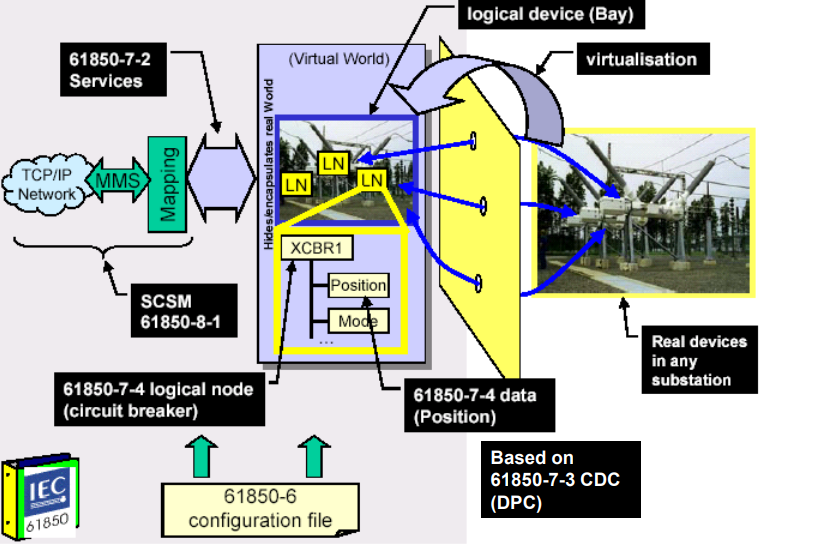
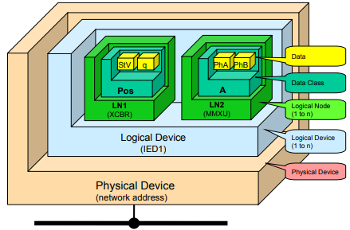
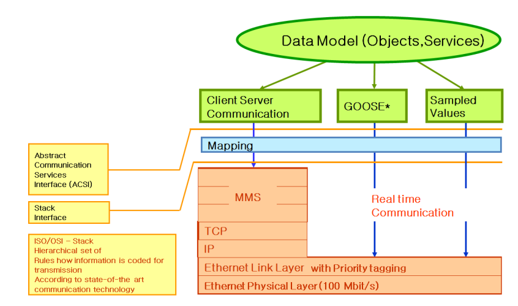
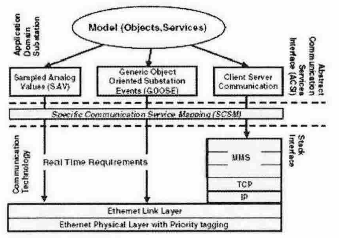

# IEC-61850 Overview
## Introduction
* IEC 61850 프로토콜은 IEC TC57의 WG10에서 제정한 변전소 자동화 시스템 전용의 프로토콜로써 1990년대 초반 미국에서 EPRI를 중심으로 개발된 UCA 2.0을 기반으로 하여 제정되었으며, 현재도 풍력, 전력품질, 수력, 분산전원 등의 분야로 지속적으로 그 영역을 확대해 나가고 있다.
* IEC 61850은 변전소 자동화 시스템에서 적용되는 변전소의 모든 기능들을 정의하고 세분화하여 사용 가능한 모든 데이터의 타입을 정의하고 이를 Object-Oreiented 형태로 구성하기 위하여 표준의 데이터 클래스(CDC-Common Data Class)를 정의하고 변전소의 모든 기증을 Object로 구성하기 위하여 CDC를 이용한 시스템 내에서 사용할 수 있는 통신이 가능한 최소의 표준 Entity인 LN(Logical Node)를 정의한다.
* IEC61850은 전력시스템 관리 및 관련 정보 교환을 위해 IEC Technical Committe 57에서 규정한 표준
* IEC 61850 규정은 10개의 파트로 나뉘어 규정하고있다.
  * Part 1 : Introduction and overview
  * Part 2 : Glossary
  * Part 3 : General requirements
  * Part 4 : System and project management
  * Part 5 : Communication requirements for functions and device models
  * Part 6 : Configuration description language for communication in electrical substations rellated to IEDs
    * "Defines an XML Schema for representing configurating information related to Substation specification, IED capabilities, Substaion and IED Configuration"
  * Part 7 : Basic communication structure for substation and feeder equipment
    * Part 7-1 : Principles and models
    * Part 7-2 : Abstract communication service interface (ACSI)
      * Information Models
      * Information exchange models
    * Part 7-3 : Common data classes
      * LNs and CDCs
    * Part 7-4 : Compatible logical node classes and data classes
      * LNs and CDCs
  * Part 8 and 9 : Specific communication service mapping (SCSM) for station bus and process bus
    * Part 8-1 : Mappings to MMS (ISO/IEC 9506-1 and ISO/IEC 9506-2) and to ISO/IEC 8802-3 2
    * Part 9-1 : Sampled values over serial unidirectional multidrop poin to point link
    * Part 9-2 : Sampled values over ISO/IEC 8802-3
* IEC 61850 Specifications

# 용어, 정의 및 약어
* ACSI (Abstract Communication Service Interface, ACSI)
  * 추상 통신 서비스 인터페이스
  * 접속 가변 접근, 자발 데이터 전송, 장치 제어 및 파일 전송 서비스 이며 실제 통신 스택이나 사용된 프로파일에 무관
* Bay
  * 변전소의 일부분으로 공통적인 기능을 가지고 다른 부분과 긴밀히 연결되어 변전소를 구성
* Device
  * 차단기, 계전기, 변전소 컴퓨터 등과 같이 요구에 부합하는 기능을 수해하도록 설계된 메커니즘이나 장비
* IED (Intelligent Electronic Device)
  * 지능형 전자장치
  * 전자식 다기능 계측기, 디지털 계전기, 제어기와 같이 외부 소스와 데이터 또는 제어를 송수신하는 기능을 가진 여러 프로세서를 가진 장치
* LN (Logical Node)
  * 데이터를 교환하는 기능의 가장 작은 부분
  * 데이터와 메소드로 정의된 객체(object)
* LD (Logical Device)
  * 연관된 논리 노드의 집합체로 존재하는 가상장치
* 프로세스 버스(Process Bus)
  * 프로세스 버스는 일차장비 레벨에서 IED가 다른 IED와 연결된 통신 네트워크
* Station Bus
  * 베이 레벨의 IED간의 연결, 스테이션 레벨의 IED간의 연결 및 베이 레벨의 IED와 스테이션 레벨 IED를 연결하는 통신 네트워크
* 특정 통신 서비스 매핑(Spcific Communication Service Mapping, SCSM)
  * ACSI 서비스와 객체를 특정 프로토콜 스택/통신 프로파일로 매핑하는 구체적인 표준화된 절차

# 기능과 통신 인터페이스의 표현
* IEC 61850 표준의 목적은 여러 제조사에서 공급한 IED들이 서로 상호 운용성을 가질 수 있도록 하기 위한 프레임워크를 제공하는 것
* IED에 기능 배치가 자유롭게 되기 위해서는 서로 다른 업체에서 공급한 장치로 전력 유틸리티에서 수행되는 기능의 상호 운용성을 제공해야 한다.
  * 기능은 서로 통신은 하지만 서로 다른 IED에서 수행하는 부분으로 분할 할 수 있음
  * 따라서 Logical Node(LN)라고 하는 모듈의 통신 특성은 IED가 필요한 상호운용성을 지원해야 함.
* 전력 유틸리티 자동화 시스템의 기능(어플리케이션 기능)은 제어, 감독 뿐만 아니라 주요 장치와 전력망의 보호와 감시에 관한 것
  * 기타 기능들은 통신감시와 같은 시스템 자체에 관한 것
  * 기능은 3개 레벨로 구분
    * 스테이션레벨
    * 베이레벨
    * 프로세스 레벨
* 프로세스 레벨
  * 일반적인 원격 입출력, 지증형 센서 및 Actuator
* 베이 레벨
  * 각 베이의 제어, 보호 또는 감시 장치를 포함
* 스테이션 레벨
  * 데이터베이스, 운영자의 작업장, 원격 통신 인터페이스를 갖춘 스테이션 컴퓨터를 포함
* 상호 운용성의 표준화 목표를 달성하기 위해서는 전력 유틸리티 자동화 시스템 내의 공통적인 기능들을 식별하고 논리노드로 분할
  * 논리 노드는 다른 장치나 다른 레벨에 위치 할 수 있다.
  * 기능이 다른 물리장치에 위치한 2개 이상의 논리 노드에서 수행되는 경우 "Distributed" 라고 말함.

# 통신
* IEC 61850에서 기본이 되는 통신환경은 Ethernet 기반의 BUS 구조를 지향하고 있다.
  * 단말간의 다대다 통신이 가능하도록 하며, 빠른 속도와 함께 데이터의 안전성과 신뢰성을 높임
* IEC 61850 기반 변전소 자동화 시스템은 3개 구조를 이루고 있다.
  * Station Level : 시스템의 중앙 서버 역할
  * Bay Level : 변전소에 있는 보호기기들의 부분
  * Process Level : 계측 설비들의 부분
# 데이터 모델링

* 물리장치 안에 논리장치로 분해
* 논리장치 안에 논리 노드, 데이터 객체 및 데이터 속성으로 분해
* 논리장치는 물리장치 즉 IED에서 지원하는 기능을 수행하는 첫 번째 레벨
  * 1개의 논리장치를 여러 IED에 분배할 수 없는 것을 제외하고는 물리장치에서 논리장치를 배치하는 방법은 표준에서 특정한 규칙은 없다.
  * 주로 1개의 IED에서 관장하며 일반적인 자동화, 보호, 기타 기능 그룹을 표현
* 논리장치는 IED의 통신 접근점과 관련 통신 서비스를 관장
* 물리장치에서 여러 논리장치는 각각 개별적인 작업 모드와 특성을 가짐
* 논리장치는 호스트로 사용하는 물리장치에 관한 정보 또는 논리장치가 제어하는 외부장치에 관한 정보를 제공
# DA(Data Attribute)
* DA는 데이터 값이나 세부 속성으로서 약 120개 정도로 분류되고 여러 종류의 데이터 타입과 값을 가짐
* 물리장치와 논리장치의 이름을 사용자가 임의로 정할 수 있으나, LN, Data, DA의 이름은 표준화되어 있다.
# 통신 방식과 특징

* IEC 61850에서 사용되는 통신방식(프로토콜)은 크게 3가지
  * MMS
  * GOOSE
  * Sampled Values
* MMS (Manufacturing Message Specification)
  * IEC 61850에서 대부분의 service를 제공해주는 통신방식
  * SCADA, OPC 서버 또는 게이트웨이와 같은 MMS 클라이언트가 모든 IED 객체에 수직적으로 액세스하는것을 허용
  * IP 기반으로 TCP/IP stack을 따름
  * 클라이언트-서버(unicast) 프로토콜 동작
  * IP 주소를 가지고 동작하며 라우터를 거침
  * 데이터의 안정성과 신뢰성을 확보하는 방식으로 OSI 7Layer 중 Transport, Network, Link, Physical을 통한 일반적인 통신 방식
  * 데이터 전송 후 확인 과정까지 거치기 때문에 2개의 Layer만 거치는 GOOSE 보다 속도가 느림
  * IEC 61850에서 MMS는 일반적인 정보 수집, 파일 전송 및 평상시 제어 명령에 사용하고 있음.
* GOOSE (Generic Object Oriented Substation)
  * IEC 61850에서 event 처리나 trip 명령과 같은 빠른 데이터 전송이 필요할 때 사용하는 통신 방식
  * Bay간에 수평으로 데이터를 교환하거나 Bay와 Process Bus 간에 수직 데이터 교환을 허용하며, 특히 상태 정보 신호와 trip 신호, 종종 Interok 신호에 사용
  * Publisher/Subscriber 구성을 원칙으로 동작하고 통상적으로 Station Bus와 Process Bus 간에 전송
  * MMS와는 달리 빠른 속도를 위해 TCP/IP의 OSI 7 Layer에서 2계층 (Link, Physical)만 이용하여 빠른 속도로 전달되지만, 데이터 유실 가능성도 존재하는 통신 방식
    * Link Layer에서 동작하기 때문에 LAN을 벗어나지 않으며 라우터를 통과할 수 없다.
    * 데이터 유실에 대비해 여러번 Message를 보냄
* Sampled Value
  * CT나 PT가 설치되어 있는 계측 지점의 Merging Unit을 통하여 데이터(전압, 전류 신호)를 IED로 전송할 때 사용하는 통신 방식
  * 통상적으로 프로세스 버스 간에 흐르나 모선 보호나 페이서 측정과 같은 스테이션 버스 상에서도 전송
* **SV는 주기적으로 정보를 보내고 GOOSE는 이벤트 발생시 정보를 보냄**
* **MMS도 event driven 방식**

* Station 계층과 Bay 계층 및 Process 계층에서 기기들(차단기, 전류/전압 변환기, 센스)간의 정보교환을 위해 필요로 한다.
  * 이 서비스에서는 또한 동작에 관한 정보(상태 표시, 제어, 측정값) 뿐만 아니라 구성 정보(파일 전송, 파라미터)도 포함하고 있다.
* 다음과 같이 3가지 통신 카테고리가 있다.
  * SV(Sampled Value) : 표준화, 정밀화, 주기적인 데이터가 요구되는 변환기의 전압 전류 샘플 값을 전송하는 메시지
  * GOOSE(Generic Object Oriented Substation) : 표준화, 정밀화 및 신뢰성 및 안전성이 요구되는 트립 명령이나 연동되는 정보의 전송에 사용되는 메시지
  * MMS(Manufacturing Message Specification) : 대부분의 운영정보가 표준화 및 적당한 우선순위, 그리고 안정된 과정을 거쳐 전송된다. 기기에 대한 특정 정보는 낮은 우선순위를 가진다.
* IEC 61850 통신에서는 주류 기술을 사용
  * ISO/OSI 계층내의 통신스택은 이더넷(1,2 계층), TCP/IP(3,4계층), MMS(5-7계층)으로 구성
* 객체 모델과 서비스는 MMS 계층에서 응용게층으로 매핑
  * 단지 SV(Sampled Value)나 GOOSE메시지 같은 임계 메시지의 경우는 응용계층에서 이더넷 계층으로 직접 맵핑
  
* 위 3가지 서비스는 서로 다른 실시간 조건을 갖음
  * TCP/IP에 기반을 둔 MMS 메시지
    * 낮은 실시간 조건을 가짐
  * SV, GOOSE 메시지
    * 높은 실시간 조건으로 인해 이더넷 계층으로 직접 맵핑
# 객체 모델
* LN(Logical Node)는 강제적 이거나 조건부적인 데이터를 가지고 있음
  * 데이터 그 자체가 데이터의 상세한 특성이나 값을 나타내는 속성을 가짐.
  * LN, 데이터 그리고 속성들이 엄격한 확장 규칙에 의해 더해질 수 있음
  * LN, 데이터 그리고 속성들이 표준화 되었기 때문에 모든 교환된 값에 대한 의미론을 제공
* LN은 비표준화된 이름을 가진 LD(Logical Device)내에서 그룹으로 묶여질 수 있다.
  * LD는 IED내에 존재하는 서버로 구현될 수 있음.

# SCL
* IEC 61850 표준에서는 XML 기반의 SCL 이라는 언어를 정의
  * 서로 다른 벤더의 IED들과 상호운용성을 제공하며 표준화된 구성정보를 표현할 수 있게 해주어 효율적으로 변전소의 엔지니어링을 가능하게 해주는 것
* SCL도 XMl 기반의 언어이기 때문에 스키마를 정의
  * SCL 스키마는 SCL 데이터에 대한 구조 명세를 표현하는 데이터를 갖고 있어 엘리먼트 구조, 타입, 어트리뷰트 등을 정의
* SCL 스키마에서 정의한 데이터들을 통해 SCL파일은 만들어진다.
* SCL 파일은 Header, Substation, Communication, IED, DataTypeTemplates 으로 구성
  * Header
    * SCL 구성 파일과 버전, 그리고 파일을 수정한 정보를 포함
  * Substation
    * 변전소 기능 구조를 설명하고 주요 장비와 그것들의 연결 정보를 나타낸다
  * IED
    * Access Point, 논리디바이스, 논리 노드 등 IED가 갖고 있는 데이터와 서비스에 대한 정보를 표현
  * Communication
    * 변전소 네트워크와 IED의 AP에 대한 통신 연결을 표현
  * DataTypeTemplate
    * LN에 포함되는 DO, DA에 대한 타입들을 포함
* SCL 파일은 4가지 형태로 작성
  * IED 구성정보를 표현하는 ICD(IED Capability Description files), 변전소의 물리적인 시스템 구성정보를 표현하는 SSD(System Specification Description files), IED를 포함한 변전소 전체의 구성정보를 표현하는 SCD(Substation Configuration Description files), 해당 변전소에서 세팅된 IED 구성정보를 표현하는 CID(Configured IED Description files)이 있다.
* 
* Data Class (defined in 7-2)
  * Data Class는 Logical Node에 포함된 품질 정보 및 타임스탬프가 있는 스위치 위치와 같은 입력된 정보를 지정하는 수단을 제공
* CDCs (defined in 7-3)
  * CDCs 는 DATA class를 구체화한것
  * CDC는 Data Atrributes(DA)의 집합이며 DA Type으로 규정됨
  * DA Type은 복합 구성 요소 또는 기본 구성 요소로 구성될 수 있다.
  * 각 기본 구성 요소는 Basic Type을 참조
* Logical Nodes (defined in 7-4)
  * Logical Node (LN)은 CDC(CompositeCDC or SimpleCDC) 각각의 종류로 정의된 Data Objects(DO)의 집합이다
  * part 7-4에서는 Logical Nodes의 규정, Data Names, 추가로 Attributes 의미까지 정의되어 있다.
  * 