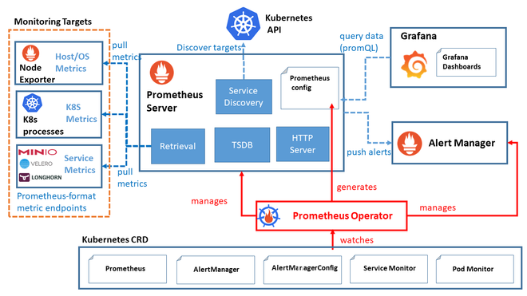
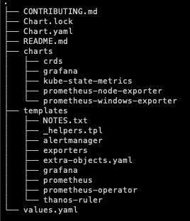

Prometheus
---
* https://xinet.kr/?p=3805
* https://leehosu.github.io/kube-prometheus-stack
---
# kube-prometheus-stack
* Kubernetes cluster에 맞게 구성된 오픈 소스 프로젝트
* Promethus를 기반으로 하며, 쿠버네티스 클러스터의 다양한 컴포넌트 들의 메트릭 데이터를 수집하고 이를 시계열 데이터로 생성하여 모니터링 및 경고 기능을 제공
* helm chart로 쉽게 설치 가능!
## Architecture

### Prometheus Operator
* Kubernetes 내에서 Prometheus 서버와 관련된 리소스들을 관리하기 위한 컨트롤러
* Promethues와 관련된 설정, 서비스 디스커버리, Rule 및 Dashboard 관리 가능
### Prometheus Server
* 고가용성을 제공하는 Promethues Server
* Metrics data를 스크랩 및 저장
### Alert Manager
* Prometheus가 수집한 메트릭 데이터를 기반으로 경고를 생성하고 관리하는 역할
### Prometheus node-exporter
* Host의 metric을 수집하는 역할
* CPU, Memory, Disk I/O 등의 데이터를 수집하여 Prometheus로 전달
### Promethues Adaptor for Kubernetes Metircs APIs
* Kubernetes의 metric API와 연동하여 클러스터 내부의 리소스 메트릭 데이터를 수집하고 Prometheus로 전달
### kube-state-metrics
* 쿠버네티스 클러스터의 상태 정보를 메트릭으로 수집
* Pod, Deployment, Node 등의 상태정보를 모니터링 가능
### Grafana
* 데이터 시각화 및 대시보드 생성 도구로써, 수집한 메트릭 데이터를 그래프나 대시보드 형태로 시각화하여 사용자에게 제공
## Configure

### Chart
* Helm 차트의 종속 Chart를 포함
* grafana, kube-state-metrics, prometheus-node-exporter 존재
### templates
* Helm chart의 템플릿 파일들을 포함
* 템플릿은 Kubernetes 리소스의 정의를 작성하는 데 사용되며, 애플리케이션의 배포, 서비스, 구성 등을 관리
### crds
* Custom Resource Definitions(CRDs) 파일을 포함할 수 있는 위치
* Kubernetes API에 사용자 정의 리소스와 그에 대한 스키마를 추가하는 데 사용
### Chart.yaml
* Helm 차트의 메타정보를 정의
### Values.yaml
* Helm 차트의 기본 구성 값을 정의
* 애플리케이션의 설정 옵션, 환경 변수, 리소스 크기 등을 설정 가능

# Prometheus Install
## Helm install
* [Helm install](https://helm.sh/docs/intro/install/)
* Kubernetes Opensource Package Manager
* Kubernetes용으로 구축된 소프트웨어를 제공, 공유 및 사용할 수 있는 기능을 제공

## Install Prometheus using helm
```bash
helm repo add prometheus-community https://prometheus-community.github.io/helm-charts
helm repo update
helm install [RELEASE_NAME] prometheus-community/kube-prometheus-stack
```
### Modify Password in values yaml
```yaml
adminPassword : 123!!@@##
```
### monitoring namespace create
```bash
kubectl create namespace monitoring
```
### helm install prometheus
```bash
helm install prometheus . -n monitoring -f values.yaml
```
### check prometheus 
```bash
kubectl get pod -n monitoring
kubectl get service -n monitoring
```
### Edit prometheus-grafana & prometheus-kube-prometheus-prometheus
* Change ClusterIP to NodePort
```bash
kubectl edit serivce -n monitoring prometheus-kube-prometheus-prometheus
~
ports:
  - name: http-web
    nodePort: 30090 // ADD
    port: 9090
    protocol: TCP
    targetPort: 9090
  - appProtocol: http
    name: reloader-web
    nodePort: 31474
    port: 8080
    protocol: TCP
    targetPort: reloader-web
  selector:
    app.kubernetes.io/name: prometheus
    operator.prometheus.io/name: prometheus-kube-prometheus-prometheus
  sessionAffinity: None
  type: NodePort // Change
status:
  loadBalancer: {}
```
```bash
kubectl edit service -n monitoring prometheus-grafana
~
spec:
  clusterIP: 10.103.190.169
  clusterIPs:
  - 10.103.190.169
  externalTrafficPolicy: Cluster
  internalTrafficPolicy: Cluster
  ipFamilies:
  - IPv4
  ipFamilyPolicy: SingleStack
  ports:
  - name: http-web
    nodePort: 31000 // ADD
    port: 80
    protocol: TCP
    targetPort: 3000
  selector:
    app.kubernetes.io/instance: prometheus
    app.kubernetes.io/name: grafana
  sessionAffinity: None
  type: NodePort // Change
status:
  loadBalancer: {}
```
* 외부에서 http://ip:30090 으로 접속시 Promethus UI 확인 가능
* http://ip:31000으로 접속하여 Grafana 접속
  * New Connnection (New data source0) => Prometheus 선택 => http://ip:30090 입력 후 Grafana와 연동

### Edit Grafana.ini
* /kube-prometheus-stack/charts/grafana 에 values.yaml 보면 grafana.ini 파일 설정할 수 있음
* 예를 들어 dashboard refresh rate가 1초가 최소인데, 250ms로 바꾸고 싶다? 아래처럼
```yaml
grafana.ini:
dashboards:  # add
  min_refresh_interval: 250ms # add
paths:
  data: /var/lib/grafana/
  logs: /var/log/grafana
  plugins: /var/lib/grafana/plugins
  provisioning: /etc/grafana/provisioning
analytics:
  check_for_updates: true
log:
  mode: console
grafana_net:
  url: https://grafana.net
server:
  domain: "{{ if (and .Values.ingress.enabled .Values.ingress.hosts) }}{{ .Values.ingress.hosts | first }}{{ else }}''{{ end }}"
```
