# OpenSSL 및 보안
- [OpenSSL 및 보안](#openssl-및-보안)
  - [Security Overview](#security-overview)
    - [Computer Security](#computer-security)
    - [보안 3요소](#보안-3요소)
    - [보안에 대한 공격](#보안에-대한-공격)
  - [기초 암호화 기법](#기초-암호화-기법)
    - [평문과 암호문](#평문과-암호문)
    - [대칭키 암호화](#대칭키-암호화)
    - [비대칭키 암호화](#비대칭키-암호화)
    - [블록암호 알고리즘](#블록암호-알고리즘)
    - [블록 암호 모드](#블록-암호-모드)
  - [OpenSSL Library](#openssl-library)
    - [OpenSSL](#openssl)
    - [OpenSSL Library 구조](#openssl-library-구조)
  - [대칭키 암호 알고리즘](#대칭키-암호-알고리즘)
    - [대칭키 암호화](#대칭키-암호화-1)
  - [DES 알고리즘](#des-알고리즘)
    - [DES 알고리즘 개요](#des-알고리즘-개요)
    - [DES 알고리즘 구조](#des-알고리즘-구조)
    - [DES 알고리즘 보안 정도](#des-알고리즘-보안-정도)
    - [DES 알고리즘의 변형](#des-알고리즘의-변형)
    - [DES API 설명](#des-api-설명)
  - [AES 알고리즘](#aes-알고리즘)
    - [AES 알고리즘 개요](#aes-알고리즘-개요)
    - [AES 파라미터](#aes-파라미터)
    - [AES 실행 단계](#aes-실행-단계)
    - [AES API 설명](#aes-api-설명)
  - [ARIA 알고리즘](#aria-알고리즘)
    - [ARIA 알고리즘 개요](#aria-알고리즘-개요)
    - [ARIA 구조](#aria-구조)
    - [ARIA API 설명](#aria-api-설명)
  - [비대칭키 암호 알고리즘](#비대칭키-암호-알고리즘)
    - [비대칭키 암호 알고리즘 개요](#비대칭키-암호-알고리즘-개요)
  - [RSA 알고리즘](#rsa-알고리즘)
    - [RSA 개요](#rsa-개요)
    - [RSA 암호화 진행 단계](#rsa-암호화-진행-단계)
    - [RSA API 설명](#rsa-api-설명)
  - [키교환 알고리즘](#키교환-알고리즘)
    - [Diffie-Hellman 키교환](#diffie-hellman-키교환)
    - [ECDH 키 교환](#ecdh-키-교환)
  - [메시지 인증 알고리즘](#메시지-인증-알고리즘)
    - [메시지 인증](#메시지-인증)
    - [메시지 인증 코드](#메시지-인증-코드)
  - [CMAC(Cipher-based MAC) 알고리즘](#cmaccipher-based-mac-알고리즘)
  - [HMAC(Hash MAC) 알고리즘](#hmachash-mac-알고리즘)
  - [CCM 알고리즘](#ccm-알고리즘)
  - [GCM(Galois/Counter Mode) 알고리즘](#gcmgaloiscounter-mode-알고리즘)
  - [메시지 압축 알고리즘](#메시지-압축-알고리즘)
    - [Hash](#hash)
    - [Hashing](#hashing)
    - [Hash 권장 조건](#hash-권장-조건)
    - [MD5](#md5)
    - [MD5의 동작 순서](#md5의-동작-순서)

## Security Overview
### Computer Security
* 개인이나 기관이 사용하는 컴퓨터와 관련된 모든 것을 안전하게 보호하는 것
* 컴퓨터 안에 들어 있는 중요한 정보를 보호하는 행위를 말함
### 보안 3요소
* 기밀성 (Confidentiality)
  * 공동으로 사용되는 통신망을 통해 이동되거나 여러 사람이 이용하는 곳에 저장되어 있는 정보를 제3자가 볼 수 없도록 하는 것
* 무결성 (Integrity)
  * 생성된 정보를 제3자 뿐만 아니라 수신자도 변경할 수 없도록 하는 것
* 가용성 (Availability)
  * 시스템이 적절한 시점에 동작할 수 있도록 하며, 인가된 사용자에게 서비스가 잘 보장되도록 하는 것
### 보안에 대한 공격
* 공격의 종류
  * 도청
    * 불법적으로 정보를 얻는 것을 말함
    * 전화 내용을 엿듣거나 타인의 통신을 무전기로 듣는 행위
    
  * 위장
    * 다른 사람으로 가장하여 그 사람의 흉내를 내는 행위
    * 이를 막기 위해 인증이 요구됨
    
  * 변형
    * 전송되는 정보의 내용을 바꾸는 것을 말함
    * 이를 막기 위해 보안의 원칙 중 무결성이 요구됨
    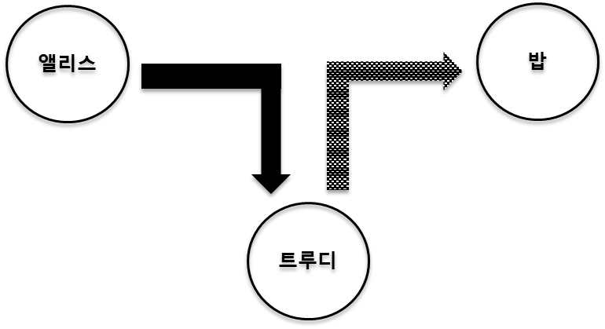
  * 중단
    * 정보가 합법적인 수신인에게 도착하지 못하도록 하는 행위
    * DoS(Denial of Service) 공격이 이에 해당
    * 보안 원칙 중 가용성이 요구됨
    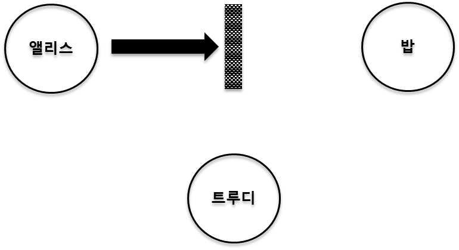
## 기초 암호화 기법
### 평문과 암호문
* 평문 : 암호화 되기전의 읽을 수 없는 문장
* 암호문 : 암호화를 통해서 읽을 수 없게 된 문장
* 암호화 : 평문을 암호문으로 바꾸는 과정
* 복호화 : 암호문을 평문으로 바꾸는 과정
* 비밀키 : 암호화 및 복호화 과정에서 사용되는 키

### 대칭키 암호화
* 암호화 할 때의 키와 복호화 할 때의 키가 같은 경우를 말함
* 암/복호화 할 때 사용되는 키는 보통 비밀키 또는 대칭키라고 함
  * 정보를 주고받는 당사자 두 명을 제외한 타인을 알지 못하도록 비밀을 관리해야 한다는 의미
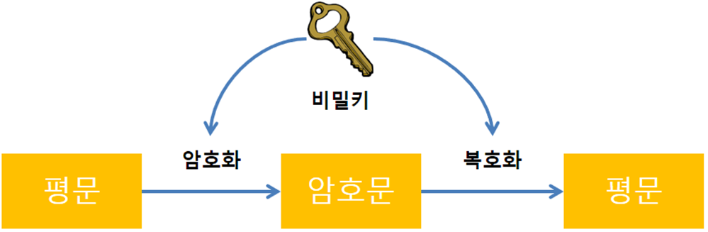
### 비대칭키 암호화
* 암호화 할 때의 키와 복호화 할 때의 키가 서로 다른 경우를 말함
* 암호화 할 때 사용되는 키는 공개키
* 복호화 할 때 사용되는 키는 개인키
  * 공개키는 타인에게 공개되어도 상관없음
  * 개인키는 타인에게 공개 되지 않아야 함
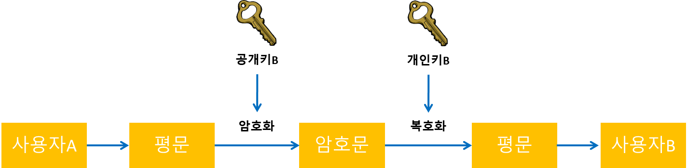 
### 블록암호 알고리즘
* 평문 블록 전체를 가지고 같은 크기의 암호문 블록 생성
* 보통 64bit, 또는 128bit 크기로 블록을 나뉘어서 사용
* 알고리즘 종류
  * AES
  * DES
  * ARIA
  * LEA 등
### 블록 암호 모드
* 각 암호화된 블록들간의 암호화 방식(블록단위의 암호화)
  * 블록들 간의 어떤 관계를 가지는가에 따라 여러 블록 암호 모드로 나뉨
* ECB(Electronic Code Book) 모드
  * 가장 단순한 모드
  * 블록간의 암호문이 독립적이며 추가적인 회로나 연산이 수행되지 않음
    * 암호문이 손상 되어도 다른 블록에 영향을 미치지 않음
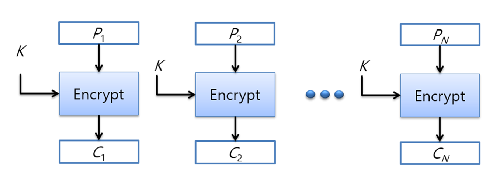
* CBC(Cipher-Block Chaining) 모드
  * ECB의 보안 결함을 위한 모드
    * 동일한 평문 블록에 대해 동일한 암호문 블록이 전송되는 문제를 해결하기 위함
  * 동일한 평문 블록이 반복되어도 상이한 암호 블록을 생성
  * 입력은 평문 블록과 선행 암호 블록의 XOR 연산 결과를 통해, 다음 블록을 얻게됨
    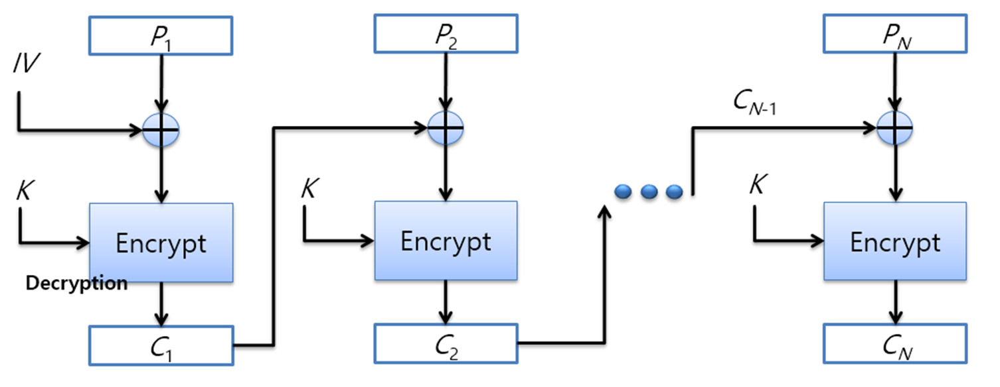
    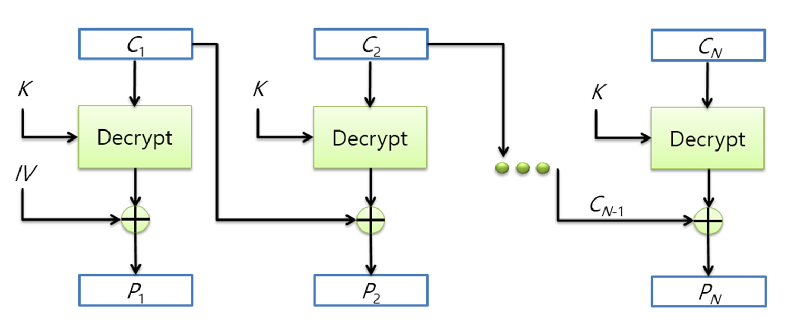
## OpenSSL Library
### OpenSSL
* 보안 프로토콜인 TLS/SSL를 오픈 된 소스의 형태로 지원하는 라이브러리
  * Commends
    * 명령어를 통해 암호화, 키 생성 등을 수행
  * SSL Library
    * SSL 통신 프로토콜을 생성하고 메시지를 전달 하는 라이브러리
  * Crypto Library
    * 보안에 필요한 여러 알고리즘을 제공하는 라이브러리
### OpenSSL Library 구조
* Continue...

## 대칭키 암호 알고리즘
### 대칭키 암호화
* 대칭키 암호화 조건
  * 암호화에 사용되는 키와 복호화에 사용되는 키가 동일
  * 한 키로부터 다른 키를 쉽게 생성할 수 있는 구조
  * 두개의 조건 중 하나이상 만족하면 됨
  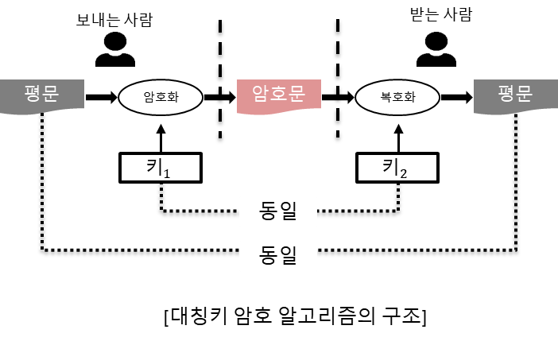
## DES 알고리즘
### DES 알고리즘 개요
* DES (Data Encryption Standard)
  * 대표적인 대칭키 블록 암호 algorithm
  * 현재 web browser 등 여러 program 에서 사용
  * 미 국립 표준국에서 컴퓨터간 통신에서의 데이터 보호를 위해 만들어짐
* DES 는 64bit 크기의 평문을 입력받아 동일한 크기의 암호문을 만듦
* 64bit 크기의 비밀키 입력 받음
* 비밀키 bit가 1번 부터 시작한다면 8의 배수에 해당하는 위치의 bit 들은 parity bit라고 생각하고 무시
  * 실제로 사용되는 비밀키의 크기는 56bit
### DES 알고리즘 구조
* 데이터를 처리하는 부분과 키를 처리하는 부분으로 이루어짐
* 데이터를 처리하는 부분의 구조
  * 초기 순열(Initial Permutation, IP)
    * 입력으로 들어온 64bit를 다른 위치로 옮기는 순열 연산 수행
  * 동일한 구조를 가진 16개의 round
    * 각 round는 round 키와 입력되는 문장을 섞음으로 혼돈과 확산을 높이는 것이 목적
  * 최종 순열
    * 초기 순열의 반대 작업
* 키를 처리하는 부분의 구조
  * 입력으로 받은 키를 각 round에서 사용할 round key로 변환하는 키 생성 부분 16개
### DES 알고리즘 보안 정도
* DES의 키는 56bit 크기이므로 2<sup>56</sup> 개의 키가 존재
* 브룻포스 공격 가정 키를 찾는데 평균 11만년 소요
  * 하나의 키에 대해서 암호화 혹은 복호화에 걸리는 시간 10<sup>-4</sup> 초 가정
  * 브룻포스 공격시 안전하다고 보장 X
    * 보완할 알고리즘 요구가 높아짐
### DES 알고리즘의 변형
* 이중 DES
  * DES 알고리즘 사용 두개의 키를 연속적으로 사용하는 것
  * 즉, 비밀키 K<sub>1</sub> 과 K<sub>2</sub> 사용 두 번 DES 암호화
  * C = E(E(P, K<sub>1</sub>),K<sub>2</sub>)
    
* 삼중 DES
  * EDE(Encrypt-Decrypt-Encrypt) 방식으로 2개의 키 사용
  * C = E(D(E(P,K<sub>1</sub>),K<sub>2</sub>),K<sub>1</sub>)
    
### DES API 설명
```c
DES_set_key(const_DES_cblock *key, DES_key_schedule *schedule)
```
* DES 암/복호화에 필요한 키 생성 API
* Parameter
  * [in] key: 암호화 키
  * [out] schedule : DES 키 스케줄러
```c
typedef unsigend char DES_cblock[8];
typedef unsigend char const_DES_cblock[8];

typedef struct DES_ks {
    union {
        DES_cblock cblock;
        DES_LONG deslong[2];
    } ks[16];
} DES_key_schedule;
```
```c
DES_encrypt1(DES_LONG *data, DES_key_schedule *ks, int enc);
```
  * DES 암/복호화 API(블록 암호 모드 사용x)
  * enc 파라미터로 암호화 인지 복호화 인지 구분
  * Parameter
    * [inout] data : 암호화인 경우 평문, 복호화인 경우 암호문
      * API에서 따로 출력 파라미터는 제공하지 않고 data 파라미터의 값이 변경됨
    * [in] ks : DES 키 스케줄러
    * [in] enc : 암/복호화 동작 구분
  ```c
  DES_cbc_encrypt(const unsigned char *input, unsigned char *output, long length, DES_key_schedule *schedule, DES_cblock *ivec, int enc);
  ``` 
  * DES 암/복호화 API(CBC 블록 암호 모드 사용)
  * enc 파라미터로 암호화 인지 복호화 인지 구분
  * Parameter
    * [in] input : 암호화인 경우 평문, 복호화인 경우 암호문
    * [out] output : 암호화인 경우 암호문, 복호화인 경우 복호문
    * [in] length : 입력 데이터 크기
    * [in] schedule : DES 키 스케줄러
    * [in] ivec : 초기화 벡터
    * [in] enc : 암/복호화 동작 구분
## AES 알고리즘
### AES 알고리즘 개요
* AES
  * 미국국립표준연구소에 의해 발표되고 유효화된 미국 표준 암호
  * DES를 대신하기 위해 개발된 대칭 블럭 암호방식
  * OpenSSL 이외에 20개 이상의 응용프로그램에서 사용
  * 30개 이상의 라이브러리를 통해서 제공
### AES 파라미터
  * 평문의 블럭사이즈는 128bit
  * 키 길이는 128bit, 192bit, 256bit
  * 키 길이에 따라 AES-128, AES-192, AES-256 으로 나뉨
  
### AES 실행 단계
  * 바이트 치환 변환 (Substitue bytes)
    * 블럭의 바이트 대 바이트 치환 변환을 수행
  * 행 이동(Shift row)
    * 행렬의 행 이동을 통한 순열 과정
  * 열 혼합(Mix columns)
    * GF(2<sup>8</sup>)산술식을 사용한 치환 과정
  * 라운드 키 더하기(Add round key)
    * 현재 블럭과 확장된 키의 일부로 단순 비트 단위의 XOR 과정
### AES API 설명
```c
#define AES_MAXNR 14
struct aes_key_st {
    #ifdef AES_LONG
        unsigned long rd_key[4 * (AES_MAXNR + 1)];
    #else
        unsigned int rd_key[4 * (AES_MAXNR + 1)];
    #endif
        int rounds;
};
typedef struct aes_key_st AES_KEY;
```
```c
int AES_set_encrypt_key(const unsigned char *userKey, const int bit, AES_key *key);
```
  * AES 암호화에 필요한 키 생성 API
  * Parameter
    * [in] userkey : 암호화 키
    * [in] bits : 암호화 키 크기
    * [out] key : AES 라운드 키
```c
int AES_set_decrypt_key(const unsigned char *userKey, const int bits, AES_KEY *key);
```
  * AES 복호화에 필요한 키 생성 API
  * Parameter
    * [in] userkey : 암호화키
    * [in] bits : 암호화 키 크기
    * [out] key : AES 라운드 키
```c
void AES_encrypt(const unsigned char *in, unsigned char *out, const AES_KEY *key);
```
  * AES 암호화 API (블록 암호 모드x)
  * Parameter
    * [in] in : 평문
    * [out] out : 암호문
    * [in] key : AES 라운드 키
```c
void AES_decrypt(const unsigned char *in, unsigned char *out, const AES_KEY *key);
```
  * AES 복호화 API (블록 암호 모드x)
  * Parameter
    * [in] in : 암호문
    * [out] out : 평문
    * [in] key : AES 라운드 키
```c
void AES_cbc_encrypt(const unsigned char *in, unsigned char *out, size_t length, const AES_KEY *key, unsigned char *ivec, const int enc);
```
  * AES 암/복호화 API (CBC 블록 암호 모드 사용)
  * enc 파라미터로 암호화 인지 복호화 인지 구분
  * Parameter
    * [in] in : 암호화인 경우 평문, 복호화인 경우 암호문
    * [out] out : 암호화인 경우 암호문, 복호화인 경우 복호문
    * [in] length : 입력 데이터 크기
    * [in] key : AES 라운드 키
    * [in] ivec : 초기화 벡터
    * [in] enc : 암/복호화 동작 구분
## ARIA 알고리즘
### ARIA 알고리즘 개요
* 대한민국의 국가보안기술연구소에서 개발한 블록 암호 체계
* 학계(Academy), 연구소(Research Institue), 정부기관(Agency)이 공동으로 개발한 특징을 함축적으로 표현
* 대한민국의 국가 표준 암호 알고리즘
* 경량 환경 및 hardware 구현을 위해 최적화된 범용 블록 암호 알고리즘
* 암호의 난이도에 따라 128bit, 192bit, 256bit 길이의 암호키 선택
* 키의 길이에 따라서 라운드 함수가 12,14,16번 반복 실행
* 라운드 키는 암호키로부터 키 확장을 통해 생성
* 128bit 데이터 블록에 대해 암호화, 복호화 수행
### ARIA 구조
* ARIA의 암호화, 복호화는 Involution SPN 구조를 가짐
* ISPN(Involution Substitution-Permutation-Networks) 구조
  * ISPN 구조는 짝수 라운드와 홀수 라운드에서 치환계층이 서로 다름
    * 일반적인 SPN 구조의 암호화 알고리즘 순서
      * 평문 -> 치환계층 -> 확산계층 -> 암호문
    * 일반적인 SPN 구조의 복호화 알고리즘 순서
      * 암호문 -> Inverse 확산계층 -> Inverse 치환계층 -> 평문
  * 짝수 라운드의 치환계층의 Inverse가 홀수 라운드의 치환계층이 됨
  * 확산계층의 Matrix의 Inverse가 자기 자신이 됨
### ARIA API 설명
```c
int EncKeySetup(const Byte *mk, Byte *rk, int keyBits)
```
  * 암호화에 사용되는 ARI 라운드 키 생성
  * Parameter   
    * [in] mk : 암호화 키
    * [out] rk : ARIA 라운드 키
    * [in] keyBits : 암호화 키 크기
```c
int DecKeySetup(const Byte *mk, Byte *rk, int keyBits)
```
  * 복호화에 사용되는 ARIA 라운드 키 생성
  * Parameter
    * [in] mk : 암호화 키
    * [out] rk : ARIA 라운드 키
    * [in] keyBits : 암호화 키 크기
```c
void Crypt(const Byte *i, int Nr, const Byte *rk, Byte *o)
```
  * ARIA 암/복호화 API
  * Parameter
    * [in] i : 암호화인 경우 평문, 복호화인 경우 암호문
    * [in] Nr : 라운드 수
    * [in] rk : ARIA 라운드 키
    * [out] o : 암호화인 경우 암호문, 복호화인 경우 복호문
## 비대칭키 암호 알고리즘
### 비대칭키 암호 알고리즘 개요
* 암호화에 사용되는 공개키는 공개적으로 배포
* 복호화에 사용되는 개인키는 노출되지 않도록 함
* 공개키와 개인키는 암호문을 받는 사람이 만듦
* 자신에게 암호문을 보낼 사람에게 공개키 배포
* 노출의 위험성이 매우 적음

* 비대칭키 알고리즘은 크게 2가지 문제의 알고리즘으로 나뉨
  * 소인수 분해, 이산대수
  
## RSA 알고리즘
### RSA 개요
* 전자서명이 가능한 최초의 알고리즘
  * 인증을 요구하는 전자 상거래 등에 RSA의 광범위한 활용을 가능하게 함
* 안정성은 큰 숫자를 소인수 분해하는 것이 어려운 것에 기반
  * 만일 큰 수의 소인수 분해를 빠르게 할 수 있는 알고리즘이 개발되면 가치 떨어짐
* 모듈러 연산 사용
### RSA 암호화 진행 단계
* 키 생성
  * 공개키와 개인키 생성
  * 공개키는 상대방에게 전달
  * 개인키는 생성자가 보관하며 복호화에 사용
* 암호화
  * 평문에 공개키를 사용하여 암호문 생성
* 복호화
  * 암호문에 개인키를 사용하여 평문 복원
### RSA API 설명
```c
int RSA_public_encrypt(int flen, unsigned char *from, unsigned char *to, RSA *rsa, int padding);
```
  * RSA의 암호화 수행
  * Parameter
    * [in] flen : 입력 데이터 크기
    * [in] from : 평문
    * [out] to : 암호문
    * [in] rsa : rsa 키 쌍(공개키, 개인키 쌍)
      * 암호화를 수행하기 때문에 실제 사용되는 키는 공개키로 사용
    * [in] padding : padding 방식을 선택
      * RSA_PKCS1_PADDING
      * RSA_PKCS1_OAEP_PADDING
      * RSA_SSLV23_PADDING
      * RSA_NO_PADDING
```c
int RSA_private_decrypt(int flen, unsigned char *from, unsigned char *to, RSA *rsa, int padding);
```
  * RSA의 복호화 수행
  * Parameter
    * [in] flen : 입력 데이터 크기
    * [in] from : 암호문
    * [out] to : 복호문
    * [in] rsa : rsa 키 쌍(공개키, 개인키 쌍)
      * 복호화를 수행하기 때문에 실제 사용되는 키는 개인키 사용
    * [in] padding : padding 방식을 선택(암호화 할때 사용했던 방식 사용)
      * RSA_PKCS1_PADDING
      * RSA_PKCS1_OAEP_PADDING
      * RSA_SSLV23_PADDING
      * RSA_NO_PADDING
```c
int RSA_private_encrypt(int flen, unsigned char *from, unsigned char *to, RSA *rsa, int padding);
```
  * RSA의 인증(서명) 수행
  * Parameter
    * [in] flen : 입력 데이터 크기
    * [in] from : 평문
    * [out] to : 암호문(서명값)
    * [in] rsa : RSA 키 쌍(공개키, 개인키 쌍)
    * [in] padding : padding 방식을 선택
      * RSA_PKCS1_PADDING
      * RSA_NO_PADDING
```c
int RSA_public_decrypt(int flen, unsigned char *from, unsigned char *to, RSA *rsa, int padding);
```
  * RSA의 인증(서명)에 대한 검증 수행
  * Parameter
    * [in] flen : 입력 데이터 크기
    * [in] from : 암호문(서명값)
    * [out] to : 복호문
    * [in] rsa : RSA키 쌍(공개키, 개인키 쌍)
    * [in] padding : padding 방식을 선택
      * RSA_PKCS1_PADDING
      * RSA_NO_PADDING

## 키교환 알고리즘
* 송신자와 수신자가 보안통신을 하기 위한 키를 공유하는 알고리즘
  * 공유된 키는 송신자와 수신자만 알아야함
* 대표적인 알고리즘
  * DH(Diffie-Hellman)
  * ECDH(Elliptic Cruve DH)

### Diffie-Hellman 키교환
* 두 사용자가 안전하게 키를 교환하는 방식
* DH 알고리즘은 이산로그 계산의 어려움에 의존
  * 양의 정수 N과 G가 알려져 있고, G의 모듈러 지수연산을 통해 B가 만들어진 경우 미지수 X에 대하여 나타낼 시
  
  * 위의 X값을 구하는 것이 이산로그문제
* 알고리즘 순서
  1. 앨리스와 밥은 어떤 정수 N과 G를 사용할 것인지 합의
  2. 앨리스는 x < N인 정수 x를 선택
  3. 앨리스는 A=G<sup>x</sup>(mod N)을 계산한 뒤, A를 밥에게 전송
  4. 밥은 y < N인 정수 y를 선택
  5. 밥은 B= G<sup>y</sup>(mod N)을 계산한 뒤, B를 앨리스에게 전송
  6. 앨리스는 밥에게 받은 B로부터 K<sub>A</sub>=B<sup>x</sup>(mod N)을 계산
  7. 밥은 앨리스에게 받은 A로부터 K<sub>B</sub>=A<sup>y</sup>(mod N)을 계산
    * K<sub>A</sub> = K<sub>B</sub> 이며 밥과 앨리스 간의 비밀키 생성
* 공격자는 비밀키인 K<sub>A</sub>(또는  K<sub>B</sub>)를 얻으려고 시도
  * 공격자는 현재 키 교환을 위해 주고받은 A와 B를 얻은 상태
  * 공격자는 X나 Y를 얻으면 비밀키를 얻을 수 있음
    * A와 B를 얻은 상태기 때문
* 하지만 X와 Y값은 앨리스와 밥이 노출하지 않은 정보이며, 값이 관련된 내용은 A와 B만 관련
* 만약 공격자가 X를 얻으려면 A=G<sup>x</sup>(mod N)을 계산
  * A,G,N이 공격자에게 알려져있지만 x를 구하는 것은 이산로그 문제를 푸는것이기 때문에 오랜시간 필요
### ECDH 키 교환
* 타원 곡선 기반의 공개키를 사용하는 키 교환 알고리즘
* 키 교환 순서
  * 우선 소수 p (약 2<sup>180</sup>)와 타원형 곡선 인자 a,b를 선택
    * 점 E<sub>q</sub>(a, b)의 타원형 그룹을 정의
    * Ex) E<sub>23</sub>(9, 17)의 그룹 -> y<sup>2</sup>mod23 = (x<sup>3</sup> + 9x + 17)mod23 로 정의
  * E<sub>p</sub>(a,b)에서 생성점 G=(x<sub>1</sub>, y<sub>1</sub>)를 선택)
    * E<sub>p</sub>(a,b)와 G는 모든 참여자에게 알려진 인자
  1. A는 n보다 적은 정수 n<sub>A</sub>를 선택, 이것은 A의 개인키가 되며 A는 공개키 P<sub>A</sub>=n<sub>A</sub> X G를 생성
    * 공개키는 E<sub>p</sub>(a,b)에서의 점
  2. B도 유사하게 개인키 n<sub>B</sub>를 선택하고 공개키 P<sub>B</sub>를 계산
  3. A는 비밀키 k = n<sub>A</sub> X P<sub>B</sub>를 생성, B는 비밀키 K=n<sub>B</sub> x P<sub>A</sub>를 생성
    * n<sub>A</sub> X P<sub>B</sub> = n<sub>A</sub> X (n<sub>B</sub> X G) = n<sub>B</sub> X (P<sub>B</sub> X G) = n<sub>B</sub> X P<sub>A</sub> 을 만족하기 때문에 동일
## 메시지 인증 알고리즘
### 메시지 인증
* 메시지의 무결성을 검증하는데 이용하는 기법 또는 서비스
* 수신받은 데이터가 전송된 것과 정확히 동일하며, 송신자로 알려진 주체의 신원이 타당함을 보장
* 네트워크 통신상의 공격
  1. 노출
  2. 트래픽 분석
  3. 위장
  4. 내용수정
  5. 순서수정
  6. 시간수정
  7. 송신처부인
  8. 수신처부인
   * 1~2 : 메시지 기밀성으로 방지
   * 3~6 : 메시지 인증으로 방지
   * 7 : 전자 서명으로 방지
   * 8 : 전자서명 및 보안 프로토콜로 방지
* 인증에 사용되는 값을 만들기 위한 알고리즘
  * 해쉬 함수
    * 임의 길이의 메시지를 고정된 길이의 해쉬값으로 대응
  * 메시지 암호화
    * 메시지의 암호문이 인증을 위해 사용
  * 메시지 인증 코드
    * 메시지의 인증에 쓰이는 작은 크기의 정보
### 메시지 인증 코드
* MAC(Message Authentication Code)라고 하며 메시지 인증에 사용
  * 메시지의 비밀키를 입력으로 하여 고정된 작은 크기의 데이터 블록 생성
  * 데이터 블록은 메시지 인증 코드가 됨
  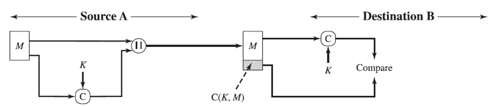
* 수신자는 받은 메시지에 동일한 연산을 수행
  * 메시지에 대해서 생성된 MAC과 수신 받은 MAC과 비교
    * 수신된 MAC과 계산된 MAC이 일치하면
      * 메시지가 변경되지 않았음을 확신
      * 합법적 송신자로부터 메시지가 왔다고 확신
## CMAC(Cipher-based MAC) 알고리즘
* 암호 기반의 메시지 인증코드
  * AES, triple-DES 사용하여 인증코드 생성
  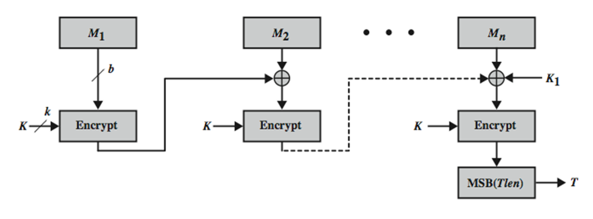
    * T = 메시지 인증 코드, 태그라고도 불림
    * Tlen = T의 비트 길이
    * MSB = 최상위 비트, 가장 큰 숫자를 왼쪽에 기록하는 자리표기법
## HMAC(Hash MAC) 알고리즘
* 해쉬 기반의 메시지 인증 코드 생성 알고리즘
  * 단방향 해쉬함수라면 어떤 것이든지 이용가능
  * 사용되는 해쉬 알고리즘에 따라 암호 강도가 달라짐
    * MAC-MD5, MAC-SHA1, MAC-SHA256 등

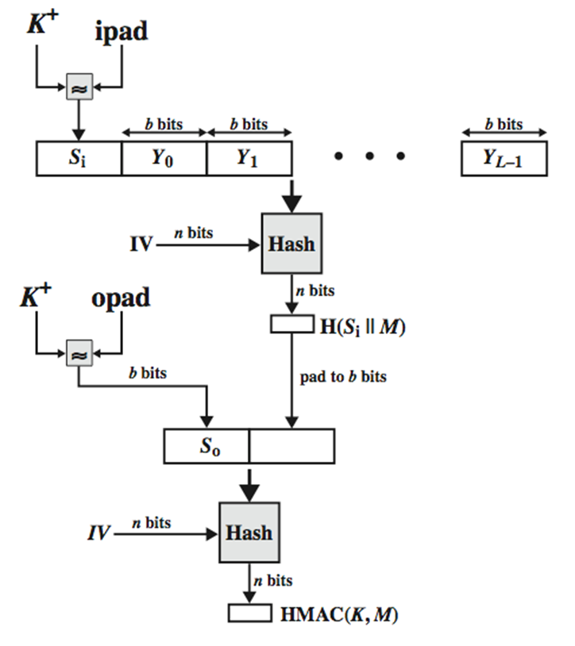
  * HMAC(K,M) = H[(K+ ⊕ opad) ∥ H[(K+ ⊕ ipad) ∥ M]] 
  * H : 내장해쉬함수(MD5 등)
  * K : 비밀키
  * M : 입력메시지
  * K<sup>+</sup> : b 비트 길이가 되도록 왼쪽을 0으로 채운 K
  * b : 블록 내에 있는 비트 수
  * IV : 해쉬 함수 초기값
  * Y<sub>i</sub> : M의 i번째 블록, 0<= i<=L-1
  * L : M에 있는 블록 수
  * n : 해쉬 코드의 길이
  * ipad : 00110110(16진수로 36)을 b/8번 반복
  * opad : 01011100(16진수로 5C)을 b/8번 반복
* 알고리즘 동작 과정
  1. b-비트 스트링 K<sup>+</sup>를 생성하기 위해 K의 왼쪽 끝에 0을 첨가
    * 예시로 K의 길이가 160 비트, b=512이면, K는 44개의 0바이트들이 첨가
  2. b-비트 블록 S<sub>i</sub> 를 생성하기 위해 K<sup>+</sup>와 ipad를 XOR
  3. M을 S<sub>i</sub>에 덧붙임
  4. 3단계에서 만든 스트림에 H를 적용
  5. b-비트 블록 S<sub>0</sub>를 생성하기 위해 K<sup>+</sup>와 opad를 XOR
  6. 단계 4에서 만든 해쉬 결과를 S<sub>0</sub>에 붙임
  7. 단계 6에서 만든 스트림 H를 적용하고 결과 출력
## CCM 알고리즘
* Counter with Cipther Block Chaining MAC
* 블록 암호 모드 종류 중 하나로 블록 암호화와 메시지인증을 같이 처리
* 알고리즘 구성요소
  * AES 암호 알고리즘
  * CTR 연산 모드
  * CMAC 알고리즘
* 하나의 키 K가 암호화와 MAC 알고리즘에 모두 사용
* 인증은 CMAC을 통해 Tag를 얻음
* 암호화는 CTR 모드를 통해 얻은 암호문, CMAC을 통해 얻은 Tag와 카운터 Ctr0를 이용하여 생성된 암호화된 태그가 합쳐져서 암호문 구성
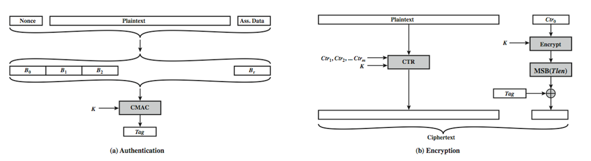
## GCM(Galois/Counter Mode) 알고리즘
* 블록 암호 모드 종류 중 하나로 블록암호화와 메시지 인증을 같이 처리
* 적은 비용과 적은 대기시간으로 많은 처리량을 제공하도록 병렬화 하여 설계
  * GCM 모드는 2개의 함수 사용
    * GHASH : 해쉬 함수, 인증 태그를 생성하는데 사용
    * GCTR : 본질적으로 CTR 모드와 유사
* NIST SP 800-38D 표준
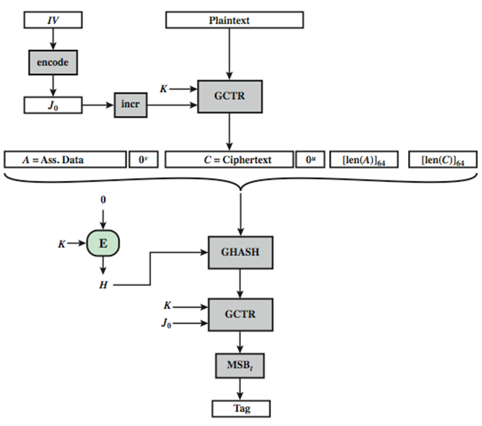
* IV : 초기화 벡터
* J<sub>0</sub> : 초기화 벡터값을 인코딩한 블록
* K : 비밀키
* A : 추가 인증 데이터
* H = E(K, 0<sup>128</sup>)
* 0<sup>128</sup> : 128개의 0으로 구성된 블럭


## 메시지 압축 알고리즘
### Hash
* Hashing에 의해 만들어진 요약이나 지문
* CRC와 같이 해당 메시지의 무결성을 보장하기 위해 사용
### Hashing
* Message Digest 라고도 불림
* 주어진 메시지를 정해진 크기의 요약 또는 지문으로 만드는 과정
### Hash 권장 조건
* 동일한 메시지에 대해서 동일한 해시가 생성되어야 함
  * M = N이면 h(M) = h(N)
* 메시지 M이 주어지면 해시 h(M)을 만드는 것은 매우 쉬워야 함
* 해시 h(M)이 주어지면 원본 메시지(M)을 찾는 것은 어려워야 함
  * 단방향성
* 메시지 M과 해시 h(M)이 주어질 때 h(M)=h(N)이고 M≠N인 N을 찾기 어려워야 함
  * 약한 충돌 방지
* h(M) = h(N)이고 M≠N을 만족하는 M과 N을 찾기 어려워야 함
  * 강한 충돌 방지
### MD5
* MD 는 Message Digest의 약자
* MD, MD2, MD4 다음으로 개발
* 32 비트 연산으로 구성
  * 32비트 컴퓨터에서 효율적으로 실행하기 위함
* 입력메시지는 512비트 크기로 처리 128 비트 크기의 해시 생성
### MD5의 동작 순서
* 패딩 (Padding)
  * 입력된 메시지의 크기를 512bit의 배수에서 64bit 부족한 길이로 패딩
  * EX) 메시지의 길이 : 600bit
    * 512*2 = 1024 => 1024 - 64 = 960
      * 즉 360 bit의 패딩 추가
* 길이 붙임 (Append length)
  * 패딩을 붙이기 전의 본래 메시지 크기를 앞서 단계의 결과물에 64bit 사이즈로 붙임
  * 만약 메시지의 크기가 2<sup>64</sup>보다 클 경우 2<sup>64</sup>로 나눈 나머지 값을 붙임
  * 길이 붙임으로 인해 전제 메시지는 512bit의 배수가 됨
* 블록 분할 및 변수 초기화
  * 길이 붙임을 한 메시지를 512bit의 블록으로 나눔
  * 해싱에 필요한 4 word buffer를 초기화함
    * 각 버퍼는 32-bits register
    * 16진수
    * low-order bytes first
* 블록처리
  * 512bit 길이의 블록을 16개의 32bit 길이의 부분 블록으로 나눔
  * 16개의 연산을 그룹화한 4라운드로 구성
  * 각 라운드마다 연산 함수는 다름

