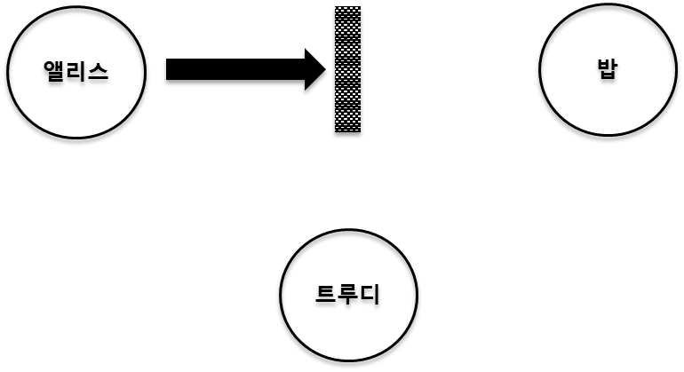
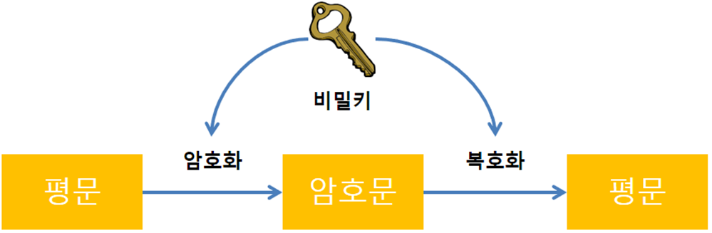
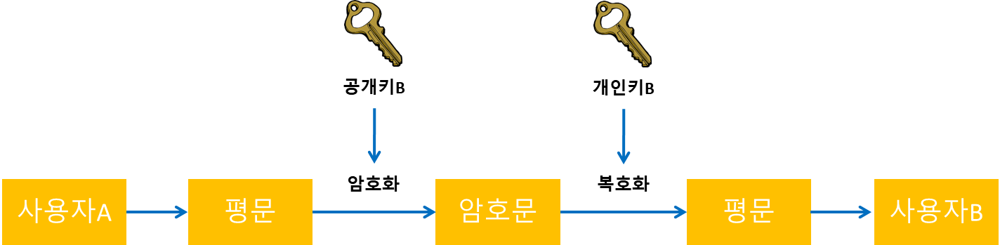
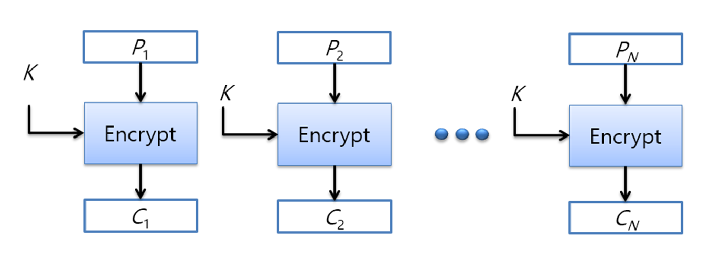
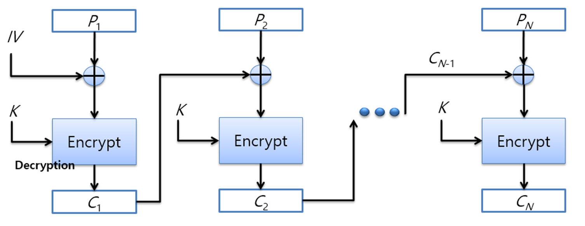
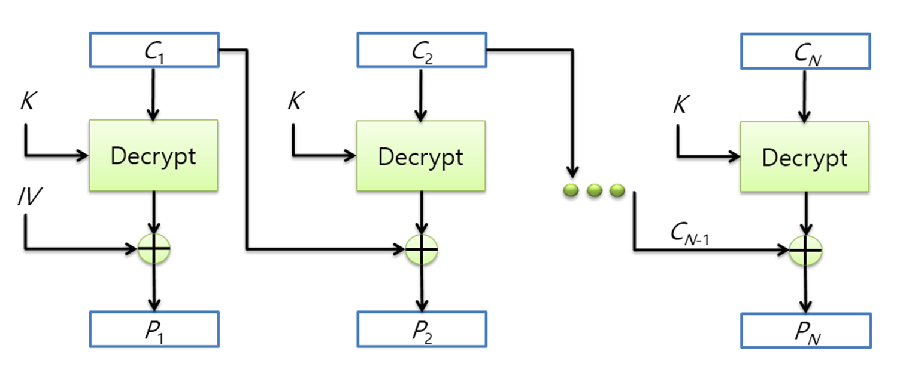
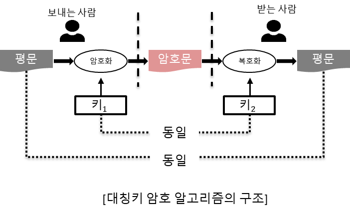
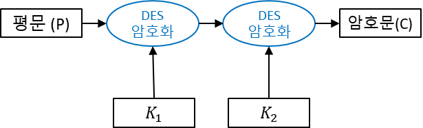
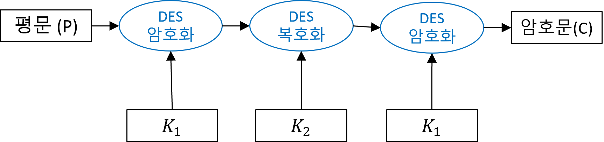

# OpenSSL 및 보안
- [OpenSSL 및 보안](#openssl-및-보안)
  - [Security Overview](#security-overview)
    - [Computer Security](#computer-security)
    - [보안 3요소](#보안-3요소)
    - [보안에 대한 공격](#보안에-대한-공격)
  - [기초 암호화 기법](#기초-암호화-기법)
    - [평문과 암호문](#평문과-암호문)
    - [대칭키 암호화](#대칭키-암호화)
    - [비대칭키 암호화](#비대칭키-암호화)
    - [블록암호 알고리즘](#블록암호-알고리즘)
    - [블록 암호 모드](#블록-암호-모드)
  - [OpenSSL Library](#openssl-library)
    - [OpenSSL](#openssl)
    - [OpenSSL Library 구조](#openssl-library-구조)
  - [대칭키 암호 알고리즘](#대칭키-암호-알고리즘)
    - [대칭키 암호화](#대칭키-암호화-1)
  - [DES 알고리즘](#des-알고리즘)
    - [DES 알고리즘 개요](#des-알고리즘-개요)
    - [DES 알고리즘 구조](#des-알고리즘-구조)
    - [DES 알고리즘 보안 정도](#des-알고리즘-보안-정도)
    - [DES 알고리즘의 변형](#des-알고리즘의-변형)

## Security Overview
### Computer Security
* 개인이나 기관이 사용하는 컴퓨터와 관련된 모든 것을 안전하게 보호하는 것
* 컴퓨터 안에 들어 있는 중요한 정보를 보호하는 행위를 말함
### 보안 3요소
* 기밀성 (Confidentiality)
  * 공동으로 사용되는 통신망을 통해 이동되거나 여러 사람이 이용하는 곳에 저장되어 있는 정보를 제3자가 볼 수 없도록 하는 것
* 무결성 (Integrity)
  * 생성된 정보를 제3자 뿐만 아니라 수신자도 변경할 수 없도록 하는 것
* 가용성 (Availability)
  * 시스템이 적절한 시점에 동작할 수 있도록 하며, 인가된 사용자에게 서비스가 잘 보장되도록 하는 것
### 보안에 대한 공격
* 공격의 종류
  * 도청
    * 불법적으로 정보를 얻는 것을 말함
    * 전화 내용을 엿듣거나 타인의 통신을 무전기로 듣는 행위
    
  * 위장
    * 다른 사람으로 가장하여 그 사람의 흉내를 내는 행위
    * 이를 막기 위해 인증이 요구됨
    
  * 변형
    * 전송되는 정보의 내용을 바꾸는 것을 말함
    * 이를 막기 위해 보안의 원칙 중 무결성이 요구됨
    
  * 중단
    * 정보가 합법적인 수신인에게 도착하지 못하도록 하는 행위
    * DoS(Denial of Service) 공격이 이에 해당
    * 보안 원칙 중 가용성이 요구됨
    
## 기초 암호화 기법
### 평문과 암호문
* 평문 : 암호화 되기전의 읽을 수 없는 문장
* 암호문 : 암호화를 통해서 읽을 수 없게 된 문장
* 암호화 : 평문을 암호문으로 바꾸는 과정
* 복호화 : 암호문을 평문으로 바꾸는 과정
* 비밀키 : 암호화 및 복호화 과정에서 사용되는 키

### 대칭키 암호화
* 암호화 할 때의 키와 복호화 할 때의 키가 같은 경우를 말함
* 암/복호화 할 때 사용되는 키는 보통 비밀키 또는 대칭키라고 함
  * 정보를 주고받는 당사자 두 명을 제외한 타인을 알지 못하도록 비밀을 관리해야 한다는 의미

### 비대칭키 암호화
* 암호화 할 때의 키와 복호화 할 때의 키가 서로 다른 경우를 말함
* 암호화 할 때 사용되는 키는 공개키
* 복호화 할 때 사용되는 키는 개인키
  * 공개키는 타인에게 공개되어도 상관없음
  * 개인키는 타인에게 공개 되지 않아야 함
 
### 블록암호 알고리즘
* 평문 블록 전체를 가지고 같은 크기의 암호문 블록 생성
* 보통 64bit, 또는 128bit 크기로 블록을 나뉘어서 사용
* 알고리즘 종류
  * AES
  * DES
  * ARIA
  * LEA 등
### 블록 암호 모드
* 각 암호화된 블록들간의 암호화 방식(블록단위의 암호화)
  * 블록들 간의 어떤 관계를 가지는가에 따라 여러 블록 암호 모드로 나뉨
* ECB(Electronic Code Book) 모드
  * 가장 단순한 모드
  * 블록간의 암호문이 독립적이며 추가적인 회로나 연산이 수행되지 않음
    * 암호문이 손상 되어도 다른 블록에 영향을 미치지 않음

* CBC(Cipher-Block Chaining) 모드
  * ECB의 보안 결함을 위한 모드
    * 동일한 평문 블록에 대해 동일한 암호문 블록이 전송되는 문제를 해결하기 위함
  * 동일한 평문 블록이 반복되어도 상이한 암호 블록을 생성
  * 입력은 평문 블록과 선행 암호 블록의 XOR 연산 결과를 통해, 다음 블록을 얻게됨
    
    
## OpenSSL Library
### OpenSSL
* 보안 프로토콜인 TLS/SSL를 오픈 된 소스의 형태로 지원하는 라이브러리
  * Commends
    * 명령어를 통해 암호화, 키 생성 등을 수행
  * SSL Library
    * SSL 통신 프로토콜을 생성하고 메시지를 전달 하는 라이브러리
  * Crypto Library
    * 보안에 필요한 여러 알고리즘을 제공하는 라이브러리
### OpenSSL Library 구조
* Continue...

## 대칭키 암호 알고리즘
### 대칭키 암호화
* 대칭키 암호화 조건
  * 암호화에 사용되는 키와 복호화에 사용되는 키가 동일
  * 한 키로부터 다른 키를 쉽게 생성할 수 있는 구조
  * 두개의 조건 중 하나이상 만족하면 됨
  
## DES 알고리즘
### DES 알고리즘 개요
* DES (Data Encryption Standard)
  * 대표적인 대칭키 블록 암호 algorithm
  * 현재 web browser 등 여러 program 에서 사용
  * 미 국립 표준국에서 컴퓨터간 통신에서의 데이터 보호를 위해 만들어짐
* DES 는 64bit 크기의 평문을 입력받아 동일한 크기의 암호문을 만듦
* 64bit 크기의 비밀키 입력 받음
* 비밀키 bit가 1번 부터 시작한다면 8의 배수에 해당하는 위치의 bit 들은 parity bit라고 생각하고 무시
  * 실제로 사용되는 비밀키의 크기는 56bit
### DES 알고리즘 구조
* 데이터를 처리하는 부분과 키를 처리하는 부분으로 이루어짐
* 데이터를 처리하는 부분의 구조
  * 초기 순열(Initial Permutation, IP)
    * 입력으로 들어온 64bit를 다른 위치로 옮기는 순열 연산 수행
  * 동일한 구조를 가진 16개의 round
    * 각 round는 round 키와 입력되는 문장을 섞음으로 혼돈과 확산을 높이는 것이 목적
  * 최종 순열
    * 초기 순열의 반대 작업
* 키를 처리하는 부분의 구조
  * 입력으로 받은 키를 각 round에서 사용할 round key로 변환하는 키 생성 부분 16개
### DES 알고리즘 보안 정도
* DES의 키는 56bit 크기이므로 256 개의 키가 존재
* 브룻포스 공격 가정 키를 찾는데 평균 11만년 소요
  * 하나의 키에 대해서 암호화 혹은 복호화에 걸리는 시간 10-4 초 가정
  * 브룻포스 공격시 안전하다고 보장 X
    * 보완할 알고리즘 요구가 높아짐
### DES 알고리즘의 변형
* 이중 DES
  * DES 알고리즘 사용 두개의 키를 연속적으로 사용하는 것
  * 즉, 비밀키 K1 과 K2 사용 두 번 DES 암호화
  * C = E(E(P, K1),K2)
    
* 삼중 DES
  * EDE(Encrypt-Decrypt-Encrypt) 방식으로 2개의 키 사용
  * C = E(D(E(P,K1),K2),K1)
    
* fdaf