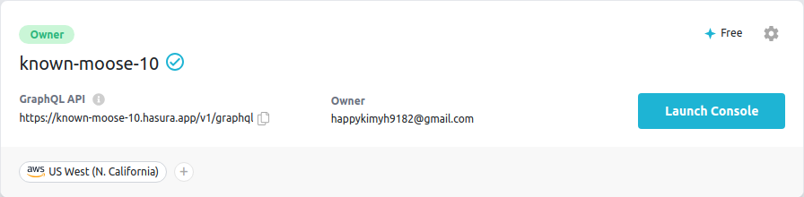
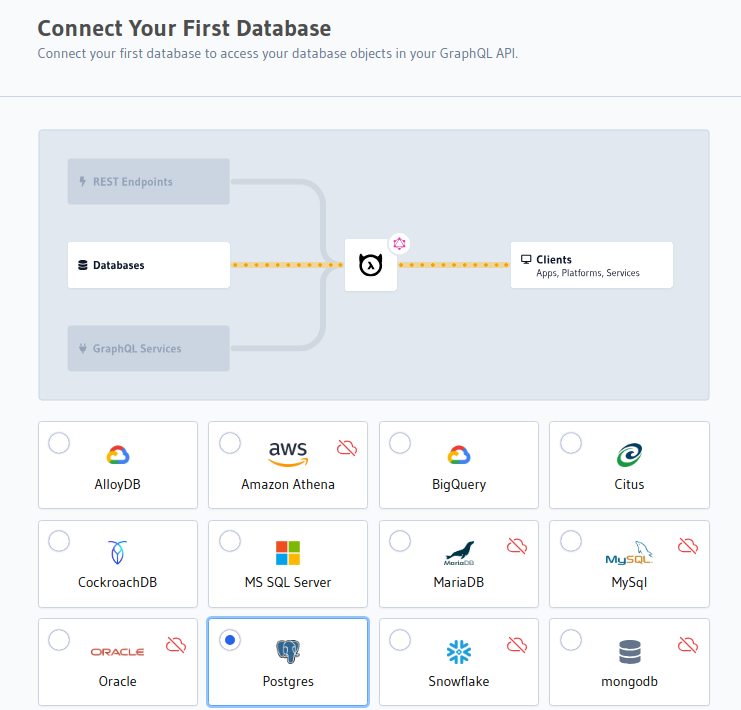
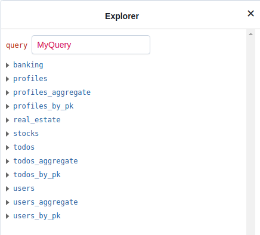
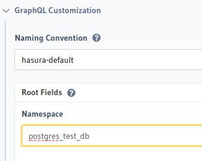

Hasura GraphQL Engine
===
*** 
## Reference Site
[Official Link](https://hasura.io/docs/latest/index/)
***
- [Hasura GraphQL Engine](#hasura-graphql-engine)
  - [Reference Site](#reference-site)
  - [Introduction](#introduction)
  - [Overview](#overview)
  - [Hasura Cloud](#hasura-cloud)
  - [Hasura using Docker](#hasura-using-docker)
  - [Hasura Use Cases](#hasura-use-cases)
    - [Build a GraphQL backend](#build-a-graphql-backend)
      - [Fully-functional backend](#fully-functional-backend)
        - [1. Connect a database](#1-connect-a-database)
        - [2. Create a data model](#2-create-a-data-model)
        - [3. Query Data](#3-query-data)
        - [4. Set up authorization](#4-set-up-authorization)
        - [5. Add custom business logic](#5-add-custom-business-logic)
      - [Build a Data Access Layer](#build-a-data-access-layer)
        - [Join the data sources and query data](#join-the-data-sources-and-query-data)
        - [Add authorization to the data sources](#add-authorization-to-the-data-sources)
        - [Mutate Data](#mutate-data)
        - [Connect a REST API](#connect-a-rest-api)
      - [Build an API gateway](#build-an-api-gateway)
  - [How It Works](#how-it-works)
    - [Tracking Tables \& Schema](#tracking-tables--schema)
    - [Views](#views)
    - [Relationships](#relationships)
    - [Resolvers](#resolvers)
    - [Metadata](#metadata)
    - [Authorization](#authorization)
    - [Actions](#actions)
    - [Remote Schemas](#remote-schemas)
    - [Event](#event)
    - [Hasura Cloud](#hasura-cloud-1)
  - [Database](#database)
    - [How Does Hasura Work with Vector Databases?](#how-does-hasura-work-with-vector-databases)
    - [Database Config](#database-config)
    - [Data Connectors](#data-connectors)
  - [Actions](#actions-1)
    - [Custom types](#custom-types)
    - [Actions Handlers](#actions-handlers)
    - [Create Actions](#create-actions)
    - [Async Actions](#async-actions)
    - [Codegen](#codegen)
    - [Derive Actions](#derive-actions)
      - [vs Actions](#vs-actions)
    - [Actions permission](#actions-permission)
    - [Actions Relationships](#actions-relationships)
    - [REST connectors](#rest-connectors)
    - [Debugging](#debugging)
  - [Remote Schemas](#remote-schemas-1)
    - [](#)
  - [Hasura Enterprise Edition](#hasura-enterprise-edition)

## Introduction
* Hasura Graphql Engine을 사용하면 GraphQL API를 통해 데이터에 즉시 액세스 가능
  * 최신 고성능 앱과 API를 10배 더 빠르게 구축하고 출시
* Hasura는 데이터베이스, REST 및 GraphQL 엔드포인트, 타사 API에 연결하여 모든 데이터에 대해 통합되고 연결된 실시간 보안 GraphQL API를 제공
## Overview
* Hasura GraphQL engine은 많은 데이터베이스 와 기타 데이터 소스에 대해 즉각적인 실시간 GraphQL API를 제공하는 빠른 GraphQL Server 이다.
* Hasura Cloud를 사용하거나 자체 인프라에서 실행하여 Hasura 사용 가능
## Hasura Cloud
* Hasura Cloud를 사용하면 고도로 최적화 되고 관리되며 대규모로 확장 가능한 Hasura 인스턴스를 몇 초만에 생성할 수 있다.
* 추가 안정성, 모니터링, 캐싱, 추적, 보안 및 배포 기능이 포함
* GraphQL 엔진의 모든 핵심 기능을 포함하는 Communitiy Edition Docker 이미지를 사용하여 Hasura를 수동으로 배포 가능
* 다양한 데이터베이스와 함께 작동할 수 있는 강력한 도구
* Hasura Cloud
  1. [cloud.hasura.io](cloud.hasura.io)로 이동하여 새 Hasura Cloud 계정 생성
  2. Hasura Cloud가 초기 프로젝트를 생성
       * Launch Console을 눌러 프로젝트 시작 가능
        
       * 또한 New Project를 눌러 프로젝트 생성 가능
  3. Cloud Provider로 AWS, Google Cloud, Azure를 선택 가능
  4. Launch Console 후 Data -> Manage -> Connect Database 선택
      
      * 위 사진은 Cloud Provider를 GC를 선택하였을 때, 지원하고 있는 데이터 베이스.
      * AWS는 위 데이터베이스 모두 지원 가능하지만, GC는 몇몇 데이터베이스는 지원하지 못하는 것으로 보임(23/12/09 기준)
  5. 데이터베이스 선택 후 Connect existing database
  6. 사용하는 데이터베이스의 URL을 이용하여 연결
     * Local에 Postgresql을 설치하여 Hasura와 연결을 시도 -> 실패.. Why..?
     * Render 이용하여 PostgreSQL DB 생성 후 생성된 URL 이용하여 Hasura와 연동
     * [Ref](https://hasura.io/docs/latest/databases/postgres/render/)
## Hasura using Docker
* [REF](https://hasura.io/docs/latest/getting-started/docker-simple/)
* Docker compose file을 이용하여 이미지 배포
  * compose file에 있는 postgresql의 비밀번호를 변경해주었음
  * compose file에 해당하는 PG_DATABASE_URL 을 Environment Variable로 Hasura에 적용 및 데이터베이스 연동
* Hasura
  * https://localhost:8080
* PostgreSQL
  * localhost:5432
* Compose File (23/12/10 기준)
  * [링크](./src/docker-compose.yml)
* 연결 후 Insert Row 를 통해 데이터 삽입
* API 란에서 Query 문 사용

## Hasura Use Cases
### Build a GraphQL backend
* 자신만의 GraphQL 백엔드를 처음부터 생성하려고 하면 많은 시간이 걸린다.
* Hasura는 몇 가지 간단한 단계를 통해 GraphQL 백엔드를 즉시 제공함으로써 문제에 대한 솔루션을 제공
#### Fully-functional backend
##### 1. Connect a database
* Hasura는 클라우드 데이터베이스 제공업체인 Neon과 파트너십을 맺고 있어 Serverless Postgresql 데이터베이스를 즉시 프로비저닝하고 이를 Hasura 프로젝트에 연결할 수 있다.
##### 2. Create a data model
* 데이터베이스에 연결한 후, 데이터 모델을 생성해야한다.
* 이는 테이블과 테이블 사이의 관계를 생성하는 프로세스
* 콘솔의 Data탭을 이용하여 손쉽게 Table을 생성 가능
  * 또는 SQL을 눌러 쿼리문으로 테이블을 생성가능
* table 간의 relationship을 생성할 수 있다.
  * 단일 쿼리로 두 테이블의 데이터를 쿼리할 수 있음
  * Data탭의 TrackAll 을 눌러 실행
##### 3. Query Data
* 만들어진 데이터로 이제 query를 할 수있음
* 기존 도구를 사용하면 reolver를 작성하고 GraphQL 서버를 설정해야 한다.
* 그러나 Hasura는 이 프로세스를 즉각적으로 쉽게 만들 수 있다.
* GraphQL Explorer를 이용하여 Query, Mutation, Subscribes를 수행할 수 있다.
  * API 탭을 이용하여 GraphQL Explorer 이동
##### 4. Set up authorization
* authorizaion을 구현하는것은 중요하면서도 어려운 부분
  * Hasura에서는 각 사용자에 대해 세부적인 권한을 부여할 수 있는 강력한 권한 시스템을 제공
* What are authorization headers?
  * Authorization Headers는 웹 서버 및 API에 대한 요청을 보호하고 인증하는데 중요한 역할
    * 요청자의 신원과 권한을 확인하는 정보가 포함되어 있음
    * 요청을 승인하고 검증하기 위해 인증 자격 증명이나 토큰을 전달하는 HTTP Header
    * 서버는 데이터의 보안과 무결성을 보장
  * Types of Authorizatin Headers
    * Bearer Token
      * Bearer 토큰은 OAuth 2.0과 같은 최신 인증 프로토콜에서 널리 사용된다.
      * 요청자에게 부여된 권한을 나타내는 문자열로 구성된다.
      * 보안측면에서 Bearer토큰은 올바르게 사용하면 강력한 보안을 제공할 수 있다.
      * 안전한 저장 및 전송과 같은 적절한 토큰 관리에 달려 있다.
    * Digest Access Authentication
      * HTTP에서 사용되는 인증 메커니즘
      * 네트워크를 통해 실제 비밀번호를 전송하지 않고 요청을 인증하는 안전한 방법을 제공
      * Digest Access Authentication은 일반 텍스트로 네트워크로 통해 비밀번호를 전송하지 않음으로써 보안을 강화
        * 대신 사용자 자격 증명의 Hash된 표현을 사용
    * AWS Authentication
      * AWS 인증늠 Amazon Web Services(AWS)에만 적용되며 API Gateway와 같은 AWS 서비스에 대한 요청을 승인하는데 사용
      * Header에는 AWS 액세스 키를 사용하여 생성된 서명이 포함되어 있어 AWS 리소스에 대한 보안 액세스를 제공
      * 보안 측면에서 AWS 인증은 암호화 서명을 사용하여 요청의 무결성과 신뢰성을 보장
##### 5. Add custom business logic
* Backend의 일반적인 요구 사항은 custom business logic 을 추가하는 것
* 특정 사용 사례를 처리하기 위해 백엔드에 사용자 지정 코드를 추가하는 프로세스
#### Build a Data Access Layer
* Hasura는 수많은 데이터 세트를 액세스 계층을 구축하는 기능을 제공
* 단일 GrpahQL 엔드포인트를 통해 모든 데이터에 액세스 할수 있으므로 한곳에서 쉽게 데이터를 모니터링 하고 보호할 수 있다.
  * hasura 공식홈페이지에서는 예시 3가지를 제공
    * 은행업무 데이터베이스
    * 주식 데이터베이스
    * 부동산 데이터베이스
* 데이터베이스와 연동을 하면 각 테이블에 지정하였던 Query 명으로 API -> Explorer에 나타나게 된다.
* 매우 더럽고 복잡해 보임.. 한번에 어떤 DB인지 구분이 안됨
  
    
* Project의 Env Val에 ```HASURA_GRPAHQL_EXPERIMENT_FEATURES: "naming_convention"``` 를 추가하여, Project를 시작
  * Docker의 경우 compose.yml에 위 변수를 추가하여 재시작해주면 됨.
* 그후 Data -> Manage -> Namespace할 DB Edit -> GraphQL Customization -> Root Fields -> Namespace 지정

    
* 그럼 사용자가 Namespace에 지정했던 이름대로 API->Explorer에서 깔끔하게 정리된것을 확인할 수 있다.
##### Join the data sources and query data
* Hasura를 이용하면 데이터베이스의 테이블과 다른 데이터베이스의 테이블 간의 Realtionships을 생성할 수 있다.
  * Data tab의 Relationship을 만들 Table을 클릭 -> Relationship -> Add Relationship
  * Example에서는 Banking의 User table과 사용자가 새로 만든 Realtionship home (Real Estate / public / properties)의 Relationship을 만들었고, user / address -> properties address와 연결하였다.
##### Add authorization to the data sources
* API 요청을 받은 Hasura가 데이터베이스에서 값을 가져올 때 권한을 추가하여 보안을 강화할 수 있음
  * Data -> 사용자의 Table -> Permissions tab -> 권한을 관리할 Column 선택
  * Custom Check 후 ```{ "id" : { "_eq" : "X-Hasura-User-Id"}}``` 작성
  * Toggle All 후 Save
* API 탭에서 Request Headers에 x-hasura-role = user , x-hasura-user-id -> 1 로 지정후 쿼리 실행
* 데이터베이스에 접근하는 사용자에 대해 권한을 지정해주었기 때문에 결과가 잘나옴
##### Mutate Data
* Hasura를 이용하여 GraphQL mutations for all your data sources.
  * this means you can create, update, delete from your databases using GraphQL
##### Connect a REST API
* Hasura를 사용하면 모든 API를 데이터 소스로 사용할 수 있음
* Actions -> Create -> Action Definition 
#### Build an API gateway
* 여러 API 환경을 hasura에서 하나로 통합하여 하나의 API로 만들 수 있음


## How It Works
* Hasura GraphQL Engine는 DB, REST endpoints, GraphQL endpoints 및 기타 소스에서 통합된 GraphQL 스키마를 자동으로 생성하므로 데이터를 함께 연결하고 이전보다 더 빠르고 강력하게 작업할 수 있다.
* 데이터베이스가 주어지면 Hasura GraphQL 엔진은 자동으로 GraphQL 스키마를 생성하고 GraphQL 쿼리, 구독 및 변형을 처리

### Tracking Tables & Schema
* Hasura GraphQL Engine을 사용해서 Table을 Track(추적)하게 되면 자동으로 다음과 같이 만들어진다.
* A GraphQL type definition for the table
  * A ***queryfield*** with **where, order_by, limit, offset, and distinct_on** arguments.
    * where : 결과 집합에 포함될 레코드를 지정하는 조건
      * ex) where age > 25
    * order_by : 결과를 특정 순서로 정렬하는 데 사용
      * ex) order_by name
    * limit : limit 절은 쿼리가 반환하는 레코드 수를 제한하는 데 사용
      * ex) limit 10 : 10개 행만 결과로 출력
    * offset : limit과 함께 사용되어 일정한 수의 행을 건너뛰고 결과를 반환, 주로 결과를 페이지로 나누는데 사용
      * ex) limit 10 offset 10: 11~20번 행 가져옴
    * Distinct_on : 특정 열 또는 열 집합에 대해 고유한 값을 반환
      * ex) distinct_on(name) : name열을 기준으로 고유한 행을 반환
* A ***query by primary key*** field
  * A ***query aggregate*** field with where, order_by, limit, offset_ and distinct_on arguments and returing, count, max, min, sum and many other aggregates.
  * An ***insert mutation field*** with **on_conflict** argument that supports upsert and bulk inserts
    * on_conflict : SQL문에서 사용하는 절로, INSERT 명령에서 데이터 베이스의 고유 제약 조건 또는 인덱스와 충돌이 발생할 때의 동작을 지정하는데 사용
      * Do nothing : 충돌이 발생한 행을 삽입하지 않고 건너뜀
      * Update : 기존 행의 특정 열을 충돌하는 행의 새 값으로 갱신
      * Raise an Error : 명시적으로 에러를 발생시켜 충돌하는 행의 삽입을 방지
* An ***update mutation*** field with where argument that supports bulk updates
* An ***update by primary key mutation*** field
* A ***delete mutation*** field with **where** argument that supports bulk deletes
* A ***delete by primary key mutation*** field
* A ***subscription*** field with **where, order_by, limit and offset** arguments.
* A ***subscription by primary key*** field
* A ***subscription aggregate*** field with **where, order_by, limit, offset, and distinct_on** arguments and returing, **count, max, min, sum** and mnay other aggregates.
* A ***subscription stream*** field with **where, and cursor** arguments
### Views
* Hasrua GraphQL Engine에서 뷰를 지원하는 데이터베이스로 뷰를 track하면 위와 동일하지만, **_by_pk** fields 없이 자동으로 생성
* 생성된 뷰에 따라서 Hasura는 insert, update, and delete mutation fields로 생성하지 않을 수 있다.
### Relationships
* Hasura GraphQL Engine에서 다른 데이터베이스의 table/view와 relationship 관계를 생성하려고 하면 다음이 수행됨
  * 중첩된 객체를 가져올 수 있도록 중첩된 유형에 대한 참조를 추가하여 table/view의 유형을 확장
  * 중첩된 객체를 기반으로 필터링 및 정렬을 허용하도록 where 절과 order_by 절을 보강한다.
### Resolvers
* Hasura GraphQL Engine에는 Resolver가 존재하지 않음
  * 실제로 GraphQL 쿼리를 효율적인 SQL 쿼리로 컴파일하는 컴파일러기 때문
* Hasura의 GraphQL 쿼리문은 GraphQL을 통해 최적화된 쿼리를 만들 수 있도록 기본 SQL의 기능을 노출하도록 최적화 되어있다.
### Metadata
* Hasura metadata는 노출된 Hasura GraphQL API 및 기타 모든 구성에 대한 설명
* yaml 파일로 생성됨
  * [Meta-Data format](https://hasura.io/docs/latest/migrations-metadata-seeds/metadata-format/)
### Authorization
* Hasura는 각 모델에 대한 규칙을 생성하여 액세스 제어가 수행되는 속성 기반 인증을 사용
  * 데이터베이스 테이블의 경우 데이터베이스 작업(Select, Insert, Update, Delete)에 대한 규칙과 각 경우에 적용해야 하는 권한을 생성할 수 있다.
### Actions
* Actions은 REST API를 사용하여 Hasura의 스키마를 확장하는 방법
* 결과를 확인하기 위해 호출되는 API 또는 REST API endpoint에 대한 스키마를 제공해야 한다.
### Remote Schemas
* Remote Schemas를 사용하면 기존 GraphQL API를 Hasura에 추가할 수 있다.
* 엔드포인트만 제공하면 되고, Hasura는 API를 검사하고 기존 스키마에 병합
* Remote Schemas에 대한 권한을 제공하고 Hasura의 다른 모델과의 관계도 생성 할 수있다.
### Event
* 이벤트 트리거는 데이터베이스 트리거를 사용하여 DML 활동을 캡쳐하고 이를 구성된 Web Hook에 안정적으로 (적어도 한번) 보냄
### Hasura Cloud
* Hasura Cloud를 사용하면 고도로 최적화되고 관리되며 대규모로 확장 가능한 Hasrua 인스턴스를 단 몇 초만에 생성 가능
* 수동으로 배포시 Docker 이미지를 사용하여 배포
## Database
* [GraphQL과 연동이 가능한 데이터베이스](https://hasura.io/docs/latest/databases/overview/)
### How Does Hasura Work with Vector Databases?
* What are vectors?
  * Vector는 텍스트, 오디오, 비디오 데이터와 같은 구조화 되지 않은 데이터를 수학적으로 표한한 것
  * LLM(large language models)과 같은 심층 신경망 모델에서 생성된 벡터는 여러 잠재 기능을 캡처하는 고차원적이며, 이를 사용하여 텍스트 또는 클러스터 관련 텍스트를 분류하는데 사용할 수 있다.
  * 단어 벡터(Word Vector)는 개별 단어의 의미와 사용 패턴을 포착하는 숫자 표현
  * 각 단어는 고차원 공간에서 벡터로 표현되며, 차원은 문맥, 구문적 역할, 의미적 속성과 같은 단어의 다양한 특징이나 속성에 해당
* Vectors in the context of Large Language Models
* Why do we need vector databases?
  * Vector Dtabases는 유사한 Vector를 검색하도록 최적화되어 있다.
### Database Config
* Hasura는 Metadata(위 Yalm 파일)과 Hasura CLI로 프로젝트 생성가능
  * [Ref](https://hasura.io/docs/latest/hasura-cli/overview/)
* Elastic Connection Pools
  * PostgreSQL와 MSSQL만 사용가능 (23/12/12 기준)
  * [Ref](https://hasura.io/docs/latest/databases/database-config/cloud-connection-pooling/)
* Dynamic Routing for Databases
  * PostgreSQL과 PostgreSQL-like backends만 사용가능 (23/12/12 기준)
  * [Ref](https://hasura.io/docs/latest/databases/database-config/dynamic-db-connection/)
### Data Connectors
* Data Connector는 현재 계속해서 개발중이라고 함
## Actions
* Actions는 REST API에 연결하여 GraphQL API에서 직접 필요한 비즈니스 로직을 얻을 수 있는 편리하고 안전한 방법
### Custom types
* https://hasura.io/docs/latest/actions/types/index/
### Actions Handlers
* HTTP Handler
  * Action이 실행 될 때, 즉 쿼리나 뮤테이션이 호출 될 때, Hasura는 action arguments와 session variables를 ```POST``` request 핸들러에 요청을 한다.
  * Returning a success response
    * 성공 응답을 반환하려면, action의 응답 페이로드를 다시 보내야한다.
    * HTTP 상태 코드는 성공 응답을 위해 ```2XX``` 상태여야함
  * Returning an error response
    * 오류 응답을 반환하면 오류 객체를 다시 보내야한다.
    ```json
    {
        "message": "<mandatory-error-message>",
        "extensions": "<optional-json-object>"
    }
    ```
    * extensions는 JSON object이어야 하며, 다른 데이터와 함께 상태 코드 필드가 있을 수 있는 JSON 개체여야한다.
    * HTTP status code는 ```4XX``` 오류 응답을 나타낸다.
### Create Actions
* Actions은 Actions 탭에서 생성이가능
* Handler는 Actions에 대한 사용자 지정 논리를 수행할 수 있는 HTTP Web Hook
* NodeJS/Express로 구현 Ex) 액세스 토큰을 반환하는 Handler
  ```js
    const handler = (req, resp) 
    =>
    {
        // You can access their arguments input at req.body.input
        const { username, password } = req.body.input;

        // perform your custom business logic
        // check if the username and password are valid and login the user

        // return the response
        return resp.json({
            accessToken: 'Ew8jkGCNDGAo7p35RV72e0Lk3RGJoJKB',
        });
    };
  ``` 
### Async Actions
* 핸들러에 접속하기 전에 클라이언트에 즉시 반환
* Mutation만 가능 Query는 모두 synchronous
### Codegen
* HTTP Handler 코드를 자동으로 생성해주는 기능
### Derive Actions
* 데이터베이스의 변경 이벤트에 의해 자동으로 트리거 되는 사용자 정의 로직
* 주로 데이터베이스의 특정 이벤트(삽입, 업데이트, 삭제 등)가 발생할 때 자동으로 실행되어 필드를 수정하거나 추가적인 작업을 수행
* 데이터 변경 작업에 대한 리액션으로 실행되며, 이를 통해 자동화된 데이터 수정이 가능
* 주로 데이터의 변경에 반응하여 데이터의 유효성을 유지하거나 특정 필드를 업데이트하는 등의 작업을 수행
#### vs Actions
* Action은 개발자가 직접 정의하고 호출하는 사용자 지정 엔드포인트
* Derive Action은 데이터베이싀 변경 이벤트에 자동으로 반응하여 실행되는 사용자 정의 로직
* 이미 정해진 Action에 대해 Drive 할 수 있다.
### Actions permission
* User에 권한을 부여하여 User마다 Action을 할 수 있음
### Actions Relationships 
* 데이터베이스의 테이블 간 관계와 관련하여 Action을 구성하고 사용하는 방식을 정의
* 여러 테이블 간의 관계가 있는 데이터를 다룰 때 더 유연하고 효율적으로 작업할 수 있다.
### REST connectors
* 기존의 RESTful한 서비스와의 통합을 용이하게 하기 위함
* REST connectors는 Hasura의 GraphQL API와 외부 RESTful API 간의 상호작용을 지원
* 장점
  * 간편한 통합: 기존에 RESTful API를 사용하는 시스템을 변경하지 않고 Hasura의 GraphQL API와 연결할 수 있습니다. 이로써 기존 시스템과의 통합을 간소화할 수 있습니다.
  * 중간 계층의 제거: REST connectors를 통해 중간 계층 없이 RESTful API를 직접 호출할 수 있습니다. 이로 인해 데이터 요청이 직접적으로 이루어져 응답 시간을 단축할 수 있습니다.
  * 유연성과 호환성: REST connectors를 사용하면 Hasura GraphQL API에서 외부 RESTful 서비스로 데이터를 가져오거나 보낼 수 있습니다. 이는 시스템 간의 유연한 데이터 이동을 가능하게 합니다.
### Debugging
* **Console Logs**: Hasura 콘솔은 GraphQL 쿼리 및 뮤테이션을 실행할 때 생성되는 로그를 제공합니다. 이를 통해 요청과 응답의 세부 정보를 확인할 수 있습니다.
* **GraphQL Playground** : Hasura는 GraphQL Playground를 제공하여 실시간으로 쿼리를 작성하고 실행하며, 쿼리 및 뮤테이션의 결과를 확인할 수 있는 강력한 도구를 제공합니다.
* **Query Performance Monitoring** : Hasura는 쿼리 성능 모니터링을 위한 도구를 제공하여 실행된 GraphQL 쿼리의 성능을 분석하고 최적화할 수 있는 기능을 제공합니다.
* **Error Handling and Logging** : Hasura는 쿼리 실행 중 발생하는 오류를 기록하고, 이를 관리자나 개발자에게 알릴 수 있는 로깅 및 오류 처리 기능을 제공합니다.
* **Metadata Inspection** : Hasura의 메타데이터 관리 기능을 통해 데이터베이스 스키마, 관계, 권한 등을 검사하고 문제를 해결할 수 있습니다.
* **Webhook Tracing** : Hasura의 웹훅 기능을 사용하는 경우, 웹훅 실행 및 응답을 추적하여 디버깅할 수 있는 기능을 제공합니다.
## Remote Schemas
* Hasura에는 Remote GraphQL 스키마를 병합하고 단일 통합 GraphQL API를 제공하는 기능이 존재
* 이를 통해 단일 Hasura endpoint에서 서로 다른 소스에 대한 쿼리 및 변형을 작성할 수 있음
* 여러 데이터 소스를 통합하여 하나의 GraphQL 엔드포인트에서 접근할 수 있도록해줌
* Hasura가 자체 데이터베이스 외에도 외부 데이터 소스를 GraphQL로 노출하고 활용할 수 있게 해주는 중요한 기능
* 외부 데이터 소스 연동
  * 외부 데이터베이스나 다른 GraphQL 서버 등과 연결하여 해당 데이터를 Hasura의 GraphQL API로 노출
* GraphQL Federation
  * 여러 데이터 소스를 조합하여 하나의 통합된 GraphQL 스키마로 제공
* 복잡한 시스템 통합
  * 여러 서비스나 데이터베이스에서 데이터를 가져와서 Hasura에서 하나의 GraphQL 엔드포인트로 통합하여 사용
* 기존 서비스와의 통합
  * 기존 RESTful API, GraphQL 서버, 혹은 다른 데이터 소스를 Hasura에서 사용할 수 있게 해줍니다. 이를 통해 Hasura를 기존 시스템에 쉽게 통합
### 

## Hasura Enterprise Edition
* Hasura GaphQL 엔진의 모든 기능을 기반으로 구축되는 동시에 관찰성, 보안, 성능과 같은 주요 기능을 갖춘 엔터프라이즈 급 솔루션을 제공하며 몇분만 에 배포 가능
* 유료서비스
