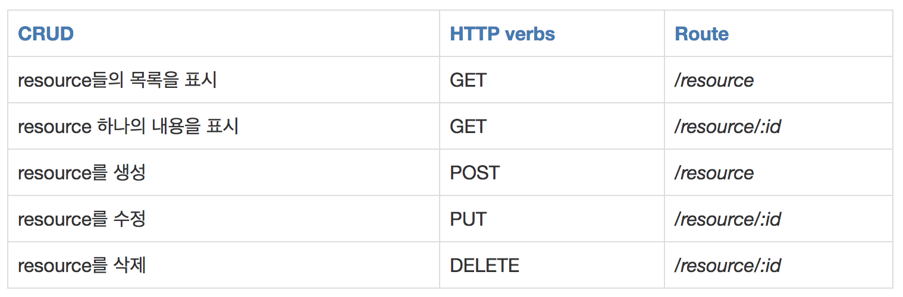

API Studying
===
- [API Studying](#api-studying)
    - [Reference Link](#reference-link)
  - [API (Application Programming Interface)](#api-application-programming-interface)
    - [API란?](#api란)
  - [REST API](#rest-api)
    - [**REST란?**](#rest란)
    - [**REST의 6가지 원칙**](#rest의-6가지-원칙)
    - [**REST 장단점**](#rest-장단점)
    - [REST가 필요한 이유](#rest가-필요한-이유)
    - [**What is a Resource?**](#what-is-a-resource)
    - [REST API 설계 기본 규칙](#rest-api-설계-기본-규칙)
    - [REST API 설계 규칙](#rest-api-설계-규칙)
    - [REST API 설계 예시](#rest-api-설계-예시)

*****
### Reference Link
* [REST API official](https://restfulapi.net/)
* [REST API non-official](https://gmlwjd9405.github.io/2018/09/21/rest-and-restful.html)
* [REST API non-official2](https://velog.io/@yhlee9753/REST-API-%EC%99%80-HTTP-Stateless-%EC%97%90-%EB%8C%80%ED%95%9C-%EA%B3%A0%EC%B0%B0)
*****

## API (Application Programming Interface)
### API란?
  * **다른 소프트웨어 시스템과 통신하기 위해 따라야 하는 규칙을 정의**
  * 클라이언트에서 요청을 보내면 서버에서 응답하는 방식
  * 애플리케이션 상에 있는 다수의 컴포넌트 간의 커뮤니케이션을 원할하게 만드는 인터페이스(interface)를 의미
* 대표 API 종류
  * SOAP API
    * Simple Object Application Programming
    * 클라이언트와 서버는 XML을 사용하여 메시지 교환
    * 과거에 많이 사용하였으며 유연성이 떨어짐
  * RPC API
    * Remote Procedure Call
    * 클라이언트가 서버에서 함수나 프로시저를 완료하면 서버가 출력을 클라이언트로 다시 전송
  * Websocket API
    * JSON 객체를 사용하여 데이터를 전달하는 웹 API
    * 클라이언트와 서버간의 양방향 통신을 지원
    * 서버가 연결된 클라이언트에 콜백 메시지 전송할 수 있어 REST API 보다 효율적
  * REST API
    * 클라이언트가 서버에 요청을 **데이터**로 전송
    * 서버가 클라이언트의 입력을 사용하여 내부 함수를 시작하고 출력 데이터를 다시 클라이언트에 반환

## REST API
### **REST란?**
  * Representational State Transfer
  * **an architectural style for distributed hypermedia systems**
  * **HTTP URI(Uniform Resource Identifier)를 통해 자원(Resource)를 명시하고, HTTP Method(POST, GET, PUT, DELETE)를 통해 해당 자원에 대한 CRUD Operation을 적용하는 것**
  * 자원 기반의 구조(ROA, Resource Oriented Architecture) 설계의 중심에 Resource가 있고 HTTP Method를 통해 Resource를 처리하도록 설계된 아키텍쳐를 의미
  * 웹 사이트의 이미지, 텍스트, DB 내용 등의 모든 자원에 고유한 ID인 HTTP URI를 부여한다.
    * CRUD Operation
      * Create : 생성(POST)
      * Read : 조회(GET)
      * Update : 수정(PUT)
      * Delete : 삭제(Delete)
      * <~~HEAD : header 정보 조회 (HEAD)~~>
  * REST 는 프로토콜이나 표준이 아닌 Architecture Style 중 하나
    * API 개발자는 다양한 방법으로 REST 구현 가능
  * REST의 구성요소
    * 자원(Resource) : URI
      * 모든 자원에 고유한 ID가 존재하고, 이 자원은 Server에 존재한다.
      * 자원을 구별하는 ID는 '/groups/:group_id'와 같은 HTTP URI다.
      * Client는 URI를 이용해서 자원을 지정하고 해당 자원의 상태(정보)에 대한 조작을 Server에 요청
    * 행위(Verb) : HTTP Method
      * HTTP protocol의 Method를 사용한다.
      * HTTP Protocol은 GET POST PUT DELETE와 같은 메서드를 제공
    * 표현 (Representation of Resource)
      * Client가 자원의 상태(정보)에 대한 조작을 요청하면 Server는 이에 적절한 응답(Representation)을 보낸다.
      * REST에서 하나의 자원은 JSON, XML, TEXT, RSS 등 여러 형태의 Representation으로 나타내어 질 수 있다.
      * JSON 혹은 XML을 통해 데이터를 주고 받는 것이 일반적
  * **A Web API(or Web Service) conforming to the REST architectural style is called a REST API (or RESTful API).**
### **REST의 6가지 원칙**
  * REST is based on some constraints and principles that promote simplicity, scalability, and statelessness in the design.
  * REST는 디자인의 단순성, 확장성 및 statelessness를 촉진하는 몇가지 제약 조건과 원칙을 기반으로 한다.
  * **Uniform(통일된, 균일된) 인터페이스 (Uniform Interfaces)**
    * 일반성의 원칙을 구성 요소 인터페이스에 적용함으로써, 전체 시스템 아키텍쳐를 단순화하고, 상호작용의 가시성을 향상시킬 수 있다.
    * 여러 아키텍쳐의 제약조건들은 균일한 인터페이스를 얻고, 컴포넌트의 동작을 알려주는데 도움이 된다.
    * URI로 지정한 리소스에 대한 조작을 통일되고 한정적인 인터페이스로 수행하는 아키텍쳐 스타일
     * **Identification of resources** : The interface must uniquely identify each resource involved in the interaction between the client and the server.
     * **Manipulation of resources through representations** : The resources should have uniform representations in the server response. API consumers should use these representations to modify the resource state in the server.
     * **Self-descriptive messages** : Each resource representations should carry enough information to describe how to process the message. It should also provide information of the additional actions that the client can perform on the resource.
     * **Hypermedia as the engine of application state** : The client should have only the initial URI of the application. The client application should dynamically drive all other resources and interactions with the use of hyperlinks.
     * **Abstract : REST defines a consistent and uniform interface for interactions between clients and servers. For example, the HTTP-based REST APIs make use of the standard HTTP methods (GET, POST, PUT, DELETE, etc.) and the URIs (Uniform Resource Identifiers) to identify resources.**
  * **Client-Server**
    * Client-Server design pattern enforces the separation of concerns(관심사 분리), which helps the client and the server components evolve independently.
    * By separating the user interface concerns (client) from the data storage concerns (server), we improve the portability(이식성) of the user interface across multiple platforms and improve scalability(확장성) by simplifying the server components.
    * While the client and the server evolve(발전), we have to make sure that the interface/contract between the client and the server does not break.
    * REST 서버는 API 제공, 클라이언트는 사용자 인증이나 컨텍스트(Session, Login 정보) 등을 직접 관리하는 구조로 각각의 역할이 확실히 구분되기 때문에 클라이언트와 서버에서 개발해야 할 내용이 명확해지고 서로간 의존성이 줄어들게 됩니다.
    * 자원이 있는 쪽이 Server, 자원을 요청하는 쪽이 Client가 된다.
      * REST Server : API를 제공하고 비즈니스 로직 처리 및 저장을 책임진다.
      * Client : 사용자 인증이나 context(세션, 로그인 정보) 등을 직접 관리하고 책임진다.
  * **Stateless**
    * 무상태성 성격을 갖는다.
    * 작업을 위한 상태정보를 따로 저장하고 관리하지 않는다.
    * 세션 정보나 쿠키정보를 별도로 저장하고 관리하지 않기 때문에 API 서버는 들어오는 요청만 단순히 처리하면 된다.
    * 서비스의 자유도가 높아지고 서버에서 불필요한 정보를 관리하지 않음으로써 구현이 단순해진다.
    * **왜 REST API는 Stateless 해야할까? - HTTP가 바로 Stateless 하기 때문**
      * **HTTP**
        * **클라이언트와 서버 사이에 이루어지는 요청/응답(request/response) 프로토콜**
        * **HTTP는 비연결성(Connectionless)과 무상태(Stateless)라는 특성을 지님**
          * **Connectionless** : 클라이언트가 요청(request)을 하고 서버가 해당 요청에 적합한 응답(response)를 하게 되면 바로 연결을 끊는 성질을 의미
          * **Stateless** : 비연결적인 특성으로 연결이 해제됨과 동시에 서버와 클라이언트는 클라이언트가 이전한 요청한 결과에 대해서 잊어버리게 된다. 즉, 클라이언트가 이전 요청과 같은 데이터를 원한다고 하더라도 다시 서버에 연결을 하여 동일한 요청을 시도해야만 한다.
    * vs Stateful
      * server side에 client와 server의 동작, 상태정보를 저장하는 형태, 세션 상태에 기반하여 server의 응답이 달라짐
  * **Cacheable**
    * REST는 HTTP라는 기존 웹 표준을 그대로 사용하기 때문에, 웹에서 사용하는 기존 인프라를 그대로 활용이 가능하다.
    * HTTP가 가진 캐싱기능이 적용가능
    * HTTP 프로토콜 표준에서 사용하는 LAST-Modified 태그나 E-Tag를 이용하면 캐싱 구현 가능
    * 대량의 요청을 효율적으로 처리하기 위해 캐시가 요구
      * 캐시(Cache) : 웹 페이지의 이미지, Style Sheet, Script, API 응답 등을 브라우저의 캐시공간에 저장
    * 캐시 사용을 통해 응답시간이 빨라지고 REST Server 트랜잭션이 발생하지 않음
      * 웹 서버에서의 특정 요청에 대한 처리가 데이터베이스의 트랜잭션으로 처리되지 않음
      * 각 요청이 독립적으로 처리되며, 하나의 요청이 다른 요청에 영향을 미치지 않음
      * 전체 응답시간, 성능, 서버의 자원 이용률을 향상
    * The cacheable constraint requires that a response should implicitly(명시적) or explicitly(암시적) label itself as cacheable or non-cacheable.
    * If the response is cacheable, the client application gets the right(권리) to reuse the response data later for equivalent requests and a specified period.
  * **Layered System**
    * The layered system style allows an architecture to be composed(구성) of hierarchical layers(계층적 레이어) by constraining(제한) component behavior.
    * In a layered system, each component cannot see beyond(~너머) the immediate layer they are interacting with.
    * Client와 Server 사이에 여러 계층(Layer)을 두는 Architecture Style
    * 시스템을 다양한 Layer로 분할함으로써 각 Layer가 독립적으로 개발, 수정, 관리될 수 있도록 설계
    * REST 서버는 다중 계층으로 구성될 수 있으며, 보안로드 밸런싱, 암호화 계층을 추가해 구조상의 유연성을 둘 수 있고, Proxy, Gateway 같은 네트워크 기반의 중간매체를 사용할 수 있게 한다.
      * 자원의 이름(자원의 표현)으로 구분하여 해당 자원의 상태(정보)를 주고 받는 모든 것을 의미
      * HTTP URI(Uniform Resource Identifier)를 통해 자원(Resource)을 명시하고, HTTP Method(GET, POST, PUT, DELETE)를 통해 해당 자원에 대한 CRUD Operation을 적용하는 것을 의미
  * **Code on Demand (Optional)**
    * REST also allows client functionally to extend by downloading and executing code in the form of applets or scripts.
    * The download code simplifier clients by reducing the number of features required to be pre-implemented(사전 구현). 
    * Servers can provide part of features delivered to the client in the form of code, and the client only needs to execute the code.
### **REST 장단점**
  * 장점
    * HTTP 프로토콜의 인프라를 그대로 사용하므로 REST API 사용을 위한 별도의 인프라를 구축할 필요가 없다.
    * HTTP 프로토콜의 표준을 최대한 활용하여 여러 추가적인 장점을 함께 가져갈 수 있게 해준다.
    * HTTP 표준 프로토콜에 따르는 모든 플랫폼에서 사용이 가능하다.
    * Hypermedia API의 기본을 충실히 지키면서 범용성을 보장한다.
    * REST API 메시지가 의도하는 바를 명확하게 나타내므로 의도하는 바를 쉽게 파악할 수 있다.
    * 여러가지 서비스 디자인에서 생길 수 있는 문제를 최소화한다.
    * 서버와 클라이언트의 역할을 명확하게 분리한다.
  * 단점
    * 표준이 존재하지않는다.
    * 안정성과 보안 문제
      * 클라이언트와 서버간의 분리로 인해 보안 취약점이 발생
      * 데이터 무결성과 보안을 보장하는 것의 어려움 존재
    * 네트워크 오버헤드
      * 매 요청마다 HTTP 요청이 발생하므로, 많은 요청을 처리해야 하는 경우 네트워크 오버헤드 발생
    * 캐싱 관리의 어려움
      * 캐싱을 통해 성능을 향상 시킬 수 있지만, 캐싱을 관리하는 것이 어려움
      * 데이터의 적절한 갱신 및 캐시 무효화를 관리
    * 구현과 설계의 복잡성
      * REST의 원칙을 준수하고 지키는 것에 대한 어려움
    * 기능 제약
      * CRUD 기능에 초점을 맞추고 있어 특정 동작이나 복잡한 연산을 위한 표준화된 방법을 제공하지 않음

### REST가 필요한 이유
  * '애플리케이션의 분리 및 통합' & '다양한 클라이언트의 등장'으로 최근 서버 프로그램은 다양한 브라우저와 안드로이드 폰, 아이폰과 같은 모바일 디바이에서도 통신을 할 수 있어야한다. 따라서 멀티플랫폼에 대한 지원을 위해 서비스 자원에 대한 아키텍쳐를 세우고 이용하는 방법을 모색한 결과, REST에 관심을 가지게 되었다.
### **What is a Resource?**
  * The key abstraction of information in REST is a resource.
  * Any information that we can name can be a resource.
    * For example, a REST resrouce can be a document or image, a temporal service, a collection of other resources, or a non-virtual object(e.g., a person)
  * The state of the resource, at any particular time, is known as the resource representation.
    * the data
    * the metadata describing the data
    * the hypermedia links that can help the clients transition to the next desired state
  * **A REST API consists of an assembly of interlinked resources. This set of resources is known as the REST API's resource model**
  * **Resource Identifiers**
    * REST uses resource identifiers to identify each resource involved in the interactions between the client and the server components.
  * **Hypermedia**
    * The data format of a representation is known as a media type
    * The media type identifies a specification that defines how a representation is to be processed
  * **Self-Descriptive**
    * resource representations shall be self-descriptive
  * **Resource Methods**
    * resource methods are used to perform the desired(원하는) transition between two states of any resource.
    * REST는 uniform interface를 중요시 한다.
### REST API 설계 기본 규칙
1. URI는 정보의 자원을 표현해야 한다.
   * resource는 동사보다는 명사를, 대문자보다는 소문자를 사용
   * resource의 도큐먼트 이름으로는 단수 명사를 사용
   * resource의 컬렉션 이름으로는 복수 명사를 사용
   * resource의 스토어 이름으로는 복수 명사를 사용
     * EX) GET /Member/1 --> GET /members/1
2. URI에 행위에 대한 동사 표현이 들어가면 안된다. (즉, CRUD 기능을 나타내는 것은 URI에 사용하지 않는다.)
   * GET /members/show/1 -> GET /members/1
   * GET /members/insert/2 -> GET /members/2
3. 경로 부분 중 변하는 부분은 유일한 값으로 대체한다.
   * student를 생성하는 route: POST/students
   * id=12인 student를 삭제하는 route: DELETE/students/12
### REST API 설계 규칙
1. 슬래시 구분자(/)는 계층 관계를 나타내는데 사용한다.
   * EX) http://restapi.example.com/houses/apartments
2. URI 마지막 문자로 슬래시(/)를 포함하지 않는다.
   * URI에 포함되는 모든 글자는 리소스의 유일한 식별자로 사용되어야 하며 URI가 다르다는 것은 리소스가 다르다는 것이고, 역으로 리소스가 다르면 URI도 달라져야한다.
   * REST API는 분명한 URI를 만들어 통신을 해야하기 때문에 혼동을 주지 않도록 URI 경로의 마지막에는 슬래시(/)를 사용하지 않는다.
3. 하이픈(-)은 URI 가독성을 높이는데 사용
   * 불가피하게 긴 URI 경로를 사용하게 된다면 하이픈을 사용해 가독성을 높인다.
4. 언더바(_)는 URI에 사용하지 않는다
   * 언더바는 보기 어렵거나 문자가 가려지기도 하므로 가독성을 위해 언더바는 사용하지 않는다.
5. URI 경로에는 소문자가 적합하다.
   * URI 경로에 대문자 사용은 피하도록 한다.
   * RFC 3986(URI 문법 형식)은 URI 스키마와 호스트를 제외하고는 대소문자를 구별하도록 규정하기 때문
6. 파일확장자는 URI에 포함하지 않는다.
   * REST API에서는 메시지 바디 내용의 포맷을 나타내기 위한 파일 확장자를 URI 안에 포함시키지 않는다.
   * Accept header를 사용한다.
   * EX) GET /members/soccer/345/photo HTTP/1.1 Host: restapi.example.com Accept:image/jpg
7. 리소스 간에는 연관 관계가 있는 경우
   * /리소스명/리소스ID/관계가 있는 다른 리소스명
   * EX) GET : /users/{userid}/devices (일반적으로 소유 'has'의 관계를 표현할 때)
### REST API 설계 예시

